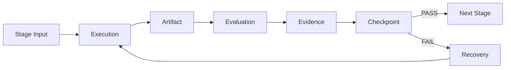
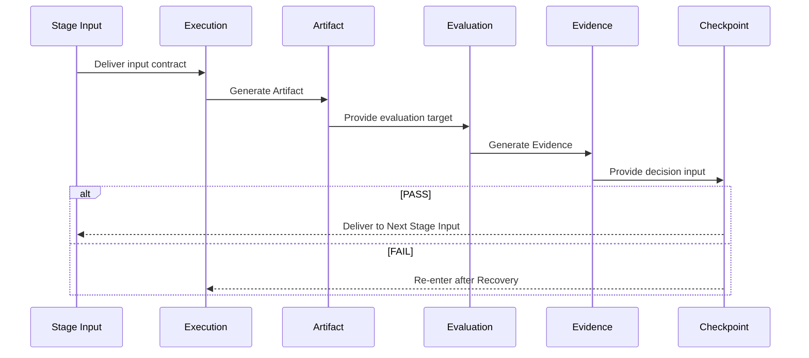

# ⚙️ Flow Architecture — Internal Stage Flow Structure

## 1. Overview

This document defines how, within a single Stage, the  
**Execution → Artifact → Evaluation → Evidence → Checkpoint**  
flow is connected and how data is transferred between elements.

For detailed definitions of each element, refer to the documents in `07_reference/`.  
This document focuses on the **connection structure and contractual relationships** between elements.

---

## 2. Overall Flow



---

## 3. Input/Output Contracts Between Elements

### 3.1 Stage Input → Execution

| Item         | Description                                                          |
| ------------ | -------------------------------------------------------------------- |
| Input        | Preceding Artifacts, Evidence, Requirements, Policies, Constraints   |
| Contract     | Input format must be defined, version-identifiable, and referencable |
| On Violation | Execution entry is denied                                            |

---

### 3.2 Execution → Artifact

| Item         | Description                                                                       |
| ------------ | --------------------------------------------------------------------------------- |
| Input        | Stage Input + Execution activities                                                |
| Output       | Verifiable Artifact                                                               |
| Contract     | Artifact must have an explicit structure, comply with contracts, and be evaluable |
| On Violation | Artifact not generated → Evaluation entry denied                                  |

Core Principles:

* Execution has a single purpose: **to generate an Artifact**
* PASS/FAIL judgments are prohibited during Execution

---

### 3.3 Artifact → Evaluation

| Item         | Description                                                         |
| ------------ | ------------------------------------------------------------------- |
| Input        | Artifact + Evaluation Criteria + Policies + Quality Thresholds      |
| Output       | Evaluation Result (PASS / FAIL), Evaluation Report, Quality Metrics |
| Contract     | Artifact must be in an evaluable state                              |
| On Violation | Evaluation cannot proceed                                           |

Evaluation Types:

* Contract Evaluation
* Quality Evaluation
* Policy Evaluation
* Human Evaluation
* Agent Evaluation

---

### 3.4 Evaluation → Evidence

| Item         | Description                                                                                     |
| ------------ | ----------------------------------------------------------------------------------------------- |
| Input        | Evaluation results                                                                              |
| Output       | Objective, reproducible Evidence                                                                |
| Contract     | Evidence must map 1:1 with Evaluation, include a clear source, timestamp, and tamper protection |
| On Violation | Evaluation without Evidence → Invalid                                                           |

Evidence Lifecycle:

```
Generated → Recorded → Frozen → Referenced → Audited / Analyzed
```

After freezing, arbitrary modification is prohibited.

---

### 3.5 Evidence → Checkpoint

| Item         | Description                                       |
| ------------ | ------------------------------------------------- |
| Input        | Artifact + Evaluation Result + Evidence           |
| Output       | PASS / FAIL decision + State Transition           |
| Contract     | Decision must be policy-based and Evidence-backed |
| On Violation | Checkpoint without policy → SSDAM violation       |

Checkpoint Decision Rules:

* Decision based solely on Artifact existence ❌
* Decision based solely on activity completion ❌
* Decision based on Evidence satisfaction ✅

---

### 3.6 Checkpoint → Branching

**PASS Path:**

```
Checkpoint PASS → Stage State COMPLETED → Next Stage READY
```

Delivered Items:

* Validated Artifact
* Generated Evidence
* Checkpoint decision record

---

**FAIL Path:**

```
Checkpoint FAIL → Stage State FAILED → Enter Recovery
```

Delivered Items:

* Failure reason
* Preserved Evidence
* Existing Artifact (unchanged)

---

### 3.7 Recovery → Execution (Re-entry)

| Item         | Description                                                                                 |
| ------------ | ------------------------------------------------------------------------------------------- |
| Input        | Failure classification, Recovery strategy, Existing Artifact/Evidence                       |
| Output       | Modified/Re-generated Artifact, Recovery Evidence                                           |
| Contract     | Failure cause must be classified, strategy justification documented, FAIL history preserved |
| On Violation | Re-entry denied                                                                             |

Recovery does **not overwrite** the previous flow.
FAIL history and prior Evidence remain preserved while a new execution cycle begins.

---

## 4. Sequence Diagram



---

## 5. Data Flow Summary

```
Stage Input
  │
  ├─ Preceding Artifacts
  ├─ Related Evidence
  ├─ Requirements / Policies
  │
  ▼
Execution ──────────► Artifact
                         │
                         ├─ Verifiable Output
                         │
                         ▼
                     Evaluation
                         │
                         ├─ PASS / FAIL
                         ├─ Quality Metrics
                         │
                         ▼
                     Evidence
                         │
                         ├─ Objective Proof
                         ├─ Measurements / Logs / Reviews
                         │
                         ▼
                     Checkpoint
                         │
                    ┌────┴────┐
                  PASS      FAIL
                    │         │
              Next Stage   Recovery
```

---

## 6. Invariant Rules

* Element order must not change
  (Execution → Artifact → Evaluation → Evidence → Checkpoint)

* Elements must not be omitted
  (Checkpoint cannot proceed without Evaluation)

* Reverse data flow is prohibited
  (Checkpoint → direct Artifact modification not allowed)

* Re-entry paths are prohibited except via Recovery

---

## 7. Anti-Patterns

❌ Execution → Direct Checkpoint (skipping Evaluation/Evidence)
❌ Evaluation without Artifact (no evaluation target)
❌ Checkpoint decision without Evidence (unsupported approval)
❌ FAIL → Next Stage without Recovery (failure ignored)
❌ Retroactive Artifact modification after Checkpoint (traceability violation)

---

## ✅ Key Summary

The internal Stage flow is:

> **Not a sequential task list, but
> a contractually connected validation pipeline**

Each element has an independent responsibility,
and progression is allowed only when the output of the preceding element
satisfies the input contract of the next.