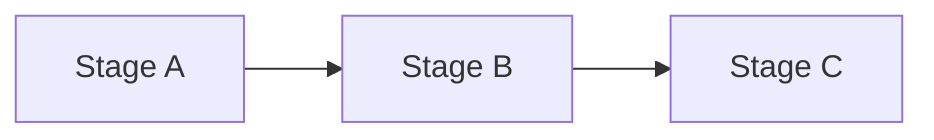
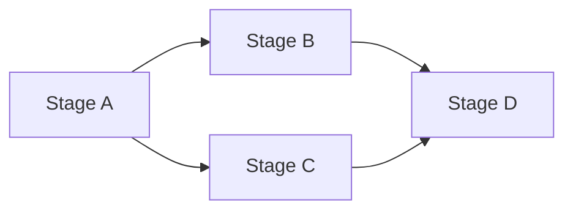
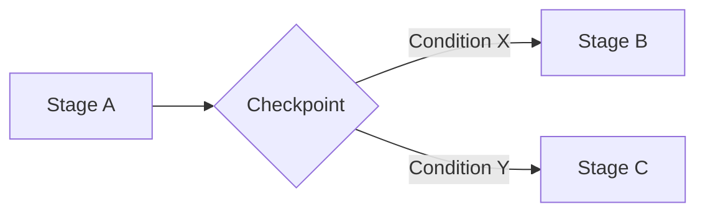
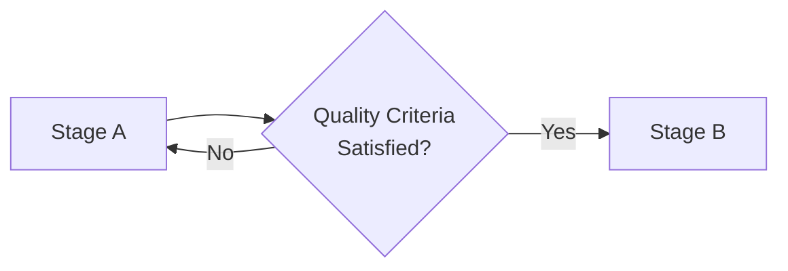
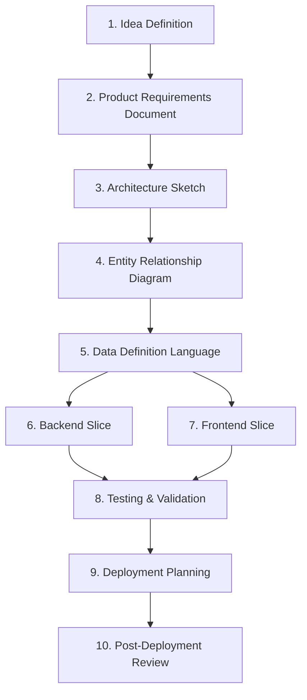

# 🧩 Stage Composition — Stage Composition Patterns

## 1. Overview

This document defines how independently designed Stages in SSDAM  
are **connected and composed to form an end-to-end execution flow**.

It concretizes SSDAM’s design goal of a “Composable Stage Architecture”  
and describes the practical application of the SOLID principles  
**Liskov Substitution (L)** and **Interface Segregation (I)**.

---

## 2. Preconditions for Composition

For a Stage to be composable, it must satisfy:

| Condition | Description |
|----------|-------------|
| Single Purpose | Internal logic focuses on one clear objective |
| Explicit Contract | Inputs/outputs are clearly defined |
| Independence | No dependency on another Stage’s internal implementation |
| Substitutability | Can be replaced by another Stage fulfilling the same contract |

---

## 3. Composition Patterns

### 3.1 Sequential Composition

The most fundamental pattern. The output of a preceding Stage  
becomes the input of the next Stage.



Connection rules:

* Output contract of Stage A = Input contract of Stage B
* Stage A must be in COMPLETED state before Stage B enters
* Skipping intermediate Stages is prohibited

Example:

```
Requirement Definition → Architecture Sketch → Data Design → Backend Implementation → Testing
```

---

### 3.2 Parallel Composition

Independent Stages execute concurrently.
All parallel Stages must reach COMPLETED
before the subsequent Stage can enter.



Connection rules:

* No input/output contract conflicts between parallel Stages
* Parallel Stages must not depend on each other’s Artifacts
* The merge Stage (Stage D) waits for all preceding COMPLETED states

Example:

```
After Architecture Sketch completion:
  ├─ Backend Slice (parallel)
  └─ Frontend Slice (parallel)
      └─ Integration Testing (merge)
```

---

### 3.3 Conditional Composition

The next Stage branches based on Checkpoint results
or Artifact properties.



Connection rules:

* Branching conditions must be defined via explicit policy
* Each branch’s input contract must be compatible with Stage A’s output
* Implicit branching is prohibited

Example:

```
After Testing & Validation Checkpoint:
  ├─ PASS + High-Risk Flag → Security Audit Stage
  └─ PASS + Normal → Deployment Planning Stage
```

---

### 3.4 Iterative Composition

The same Stage is repeated until a condition is satisfied.

This differs from Recovery:
Iterative Composition is **designed repetition**,
whereas Recovery is **failure-driven correction**.



Connection rules:

* Maximum iteration count must be defined
* Evidence accumulates across iterations
* Escalation required if max count is exceeded

Example:

```
Prototype Validation:
  Repeat execution (max 3 times)
  → Upon meeting quality criteria → Main Implementation Stage
```

---

## 4. Stage Substitution (Liskov Substitution)

According to the Liskov Substitution Principle,
Stages fulfilling the same contract must be interchangeable.

### 4.1 Substitution Conditions

| Condition                    | Description                         |
| ---------------------------- | ----------------------------------- |
| Compatible Input Contract    | Accepts same or broader inputs      |
| Compatible Output Contract   | Produces same or narrower outputs   |
| Artifact Format Preservation | Meets downstream expectations       |
| Evaluation Compatibility     | Same evaluation criteria applicable |

### 4.2 Example

Original:

```
Data Design (Manual ERD Creation)
  Input: Requirement Document
  Output: schema.mmd
```

Substitute:

```
Data Design (AI-Assisted ERD Generation)
  Input: Requirement Document
  Output: schema.mmd
```

Since the contracts are identical, substitution is valid.
Internal Execution differences (manual vs AI)
do not affect composition structure.

---

## 5. Contract Design Principle (Interface Segregation)

Following the Interface Segregation Principle,
Stage contracts must be defined at minimal granularity.

### 5.1 Rules

* Do not mix multiple concerns in a single contract
* Do not force unused outputs onto downstream Stages
* Input contracts include only what is truly required

### 5.2 Good Example

```
Stage: Backend Slice
  Input Contract: schema.mmd, api-spec.yaml
  Output Contract: compiled-code, test-report.json
```

Each Artifact has a clear, singular role.

### 5.3 Bad Example

```
Stage: Backend Slice
  Input Contract: project-bundle.zip
    (requirements + design + configs + meeting notes)
```

Bundling everything prevents contract validation
and obscures dependencies.

---

## 6. Practical Composition Example

Composition of example Stages defined in SSDAM.md:



Pattern analysis:

| Segment     | Pattern    | Description                  |
| ----------- | ---------- | ---------------------------- |
| S1 → S5     | Sequential | Definition → Design flow     |
| S5 → S6, S7 | Parallel   | Backend/Frontend concurrency |
| S6, S7 → S8 | Merge      | Integration testing          |
| S8 → S10    | Sequential | Deployment flow              |

---

## 7. Composition Invariants

* Connecting Stages without contracts is prohibited
* Connections based on internal implementation are prohibited
* Implicit branching/merging is prohibited
* Circular references are prohibited
  (Iterative composition requires explicit exit conditions)
* Direct Artifact sharing between parallel Stages is prohibited

---

## 8. Anti-Patterns

❌ Monolithic Stage — Multiple objectives merged into one Stage
❌ Implicit Dependency — Relying on internal state without contracts
❌ Missing Branches — Runtime decisions without predefined paths
❌ Infinite Iteration — No exit condition/max count
❌ Bundled Contracts — Overloaded input containers

---

## ✅ Key Summary

Stage Composition is:

> **Not “listing steps in order,” but
> “architecting independent purpose units via explicit contracts.”**

In SSDAM, composability depends on:

* Contract clarity
* SOLID compliance
* Structural support for substitution, extension, and branching

It is a core architectural property —
not merely a workflow arrangement.