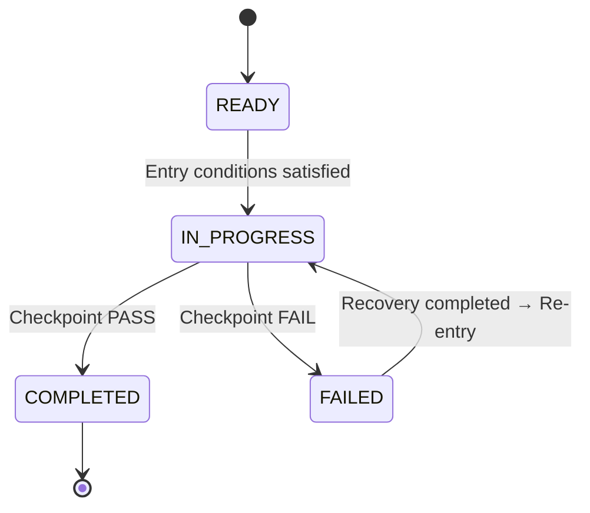

# 🔄 Stage Lifecycle — Stage State Machine

## 1. Overview

This document defines the **States**, **Transitions**, and **Guards**
of an SSDAM Stage.

A Stage is not a simple workflow step,
but operates as a **verification-driven state transition model**.

---

## 2. State Definitions

| State | Description |
|-------|-------------|
| **READY** | Preconditions satisfied, waiting for execution |
| **IN_PROGRESS** | Execution in progress (Execution → Artifact → Evaluation → Evidence) |
| **COMPLETED** | Terminated via Checkpoint PASS |
| **FAILED** | Terminated via Checkpoint FAIL |

---

## 3. State Transition Diagram

---

## 4. Transition Conditions (Guards)

### 4.1 READY → IN_PROGRESS

Entry Conditions:

* Prior Stage COMPLETED (except the first Stage)
* Input Artifact exists
* Input contract satisfied
* Required resources secured

If violated:

→ Entry denied, remain in READY

---

### 4.2 IN_PROGRESS → COMPLETED

Transition Conditions:

* Artifact creation completed
* Evaluation completed
* Evidence secured
* Checkpoint PASS decision

**All conditions must be satisfied**

---

### 4.3 IN_PROGRESS → FAILED

Transition Conditions (one or more):

* Evaluation criteria not met
* Artifact contract violation
* Missing mandatory evidence
* Quality threshold not met
* Risk level exceeds tolerance

Mandatory actions upon FAIL:

1. Record failure reason
2. Preserve Evidence
3. Determine Recovery strategy

---

### 4.4 FAILED → IN_PROGRESS (Recovery Re-entry)

Re-entry Conditions:

* Failure cause classified
* Recovery strategy selected and executed
* Recovery Artifact created
* Recovery Evidence recorded
* Justification for re-entry secured

If re-entry denied:

→ Remain in FAILED, perform escalation

---

## 5. Escalation Rules

Human intervention is mandatory when:

| Condition                              | Action                      |
| -------------------------------------- | --------------------------- |
| Repeated identical failure (≥ N times) | Request human judgment      |
| Uncertainty exceeds threshold          | Promote to human Checkpoint |
| Conflicting Evidence                   | Human arbitration           |
| Recovery strategies exhausted          | Human redesign decision     |

Default value of **N** is defined by project policy.

---

## 6. State Invariants

* No direct transition from READY → COMPLETED
* No direct transition from READY → FAILED
* No termination without passing through IN_PROGRESS
* No reverse transition COMPLETED → FAILED
* No missing transition records

---

## 7. Traceability Requirements

All state transitions must record:

| Item             | Description                  |
| ---------------- | ---------------------------- |
| Transition Time  | Timestamp                    |
| Previous State   | FROM State                   |
| Next State       | TO State                     |
| Transition Basis | Checkpoint / Recovery result |
| Actor            | Human / Agent / Policy       |

---

## 8. Anti-Patterns

❌ Implicit transitions — state changes without records
❌ Guard-skipping transitions — proceeding without conditions
❌ Infinite Recovery loops — retries without escalation
❌ State skipping — READY → COMPLETED shortcut

---

## ✅ Key Summary

The Stage State Machine is:

> **Not a “flow control mechanism,”
> but a “deterministic rule set for verification-driven state transitions.”**

In SSDAM, Stage progression is allowed only by:

* Activity completion ❌
* Time passage ❌
* **Verified condition satisfaction ✅**
