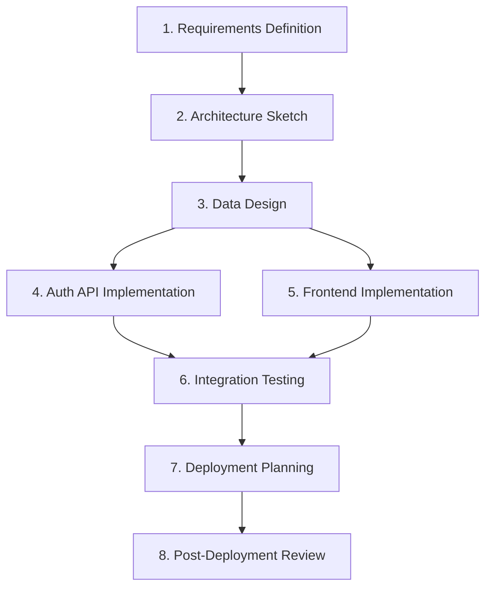

# 📋 Project Planning Guide

## 1. Overview

This document defines the **procedure for decomposing project goals into SSDAM Stages and constructing the overall execution flow**.

Individual Stage design should follow `03_methodology/stage-design-guide.md`.  
This guide focuses on **inter-stage relationships and project-level policies**.

Planning procedure:

```
Goal Decomposition → Stage Identification → Dependency Analysis → Composition Design → Policy Definition → Plan Validation
```

---

## 2. Step 1 — Goal Decomposition

Decompose the final project objective into **independently verifiable sub-goals**.

### 2.1 Decomposition Criteria

| Criterion | Key Question |
|----------|--------------|
| Verifiability | Can this goal be evaluated objectively? |
| Independence | Can this goal be completed independently from others? |
| Artifact Presence | Can the outcome be expressed as a concrete Artifact? |

### 2.2 Decomposition Procedure

1. Describe the final objective  
2. Repeatedly ask: *“What must be verified first to achieve this?”*  
3. Stop when further decomposition is not meaningful or converges to a single purpose  
4. Validate each sub-goal against the criteria above

### 2.3 Example

Final Objective:  
“Deploy a web application with user authentication”

```
Deploy Web Application
├─ Are requirements defined?
├─ Is the architecture validated?
├─ Is the data structure finalized?
├─ Is the authentication API implemented/validated?
├─ Is the frontend implemented/validated?
├─ Have integration tests passed?
├─ Is the deployment plan defined?
└─ Is post-deployment stability verified?
```

### 2.4 Anti-Patterns

- ❌ “Backend complete” → unclear validation criteria → requires decomposition  
- ❌ “Create a great UX” → Artifact undefined → requires specification  
- ✅ “Implement authentication API endpoints and pass tests” → verifiable, Artifact clear

---

## 3. Step 2 — Stage Identification

Transform decomposed sub-goals into **SSDAM Stages**.

### 3.1 Transformation Rules

For each sub-goal:

| Condition | Rule |
|----------|------|
| Single Purpose | Split if multiple purposes exist |
| Generates Artifact | Otherwise, not a Stage |
| Terminates via Checkpoint | Redefine if impossible |
| I/O Contract Definable | Adjust scope if undefined |

### 3.2 Stage List Example

| # | Stage | Purpose | Key Artifact |
|---|-------|---------|--------------|
| 1 | Requirements Definition | Structure product requirements | requirements.md |
| 2 | Architecture Sketch | Design system structure | architecture.md |
| 3 | Data Design | Model entity relationships | schema.mmd |
| 4 | Auth API Implementation | Implement auth endpoints | auth-api (code) |
| 5 | Frontend Implementation | Build UI components | frontend (code) |
| 6 | Integration Testing | Validate full system | test-report.json |
| 7 | Deployment Planning | Define deployment procedure | deploy-plan.md |
| 8 | Post-Deployment Review | Verify operational stability | post-deploy-report.md |

### 3.3 Validation Questions

- Have all sub-goals been mapped to Stages?  
- Are any goals skipped without a Stage?  
- Does any Stage mix multiple purposes?

---

## 4. Step 3 — Dependency Analysis

Analyze **precedence and Artifact dependencies** between Stages.

### 4.1 Dependency Matrix Example

| Stage | Prerequisite | Required Artifact |
|-------|-------------|------------------|
| Requirements Definition | — | — |
| Architecture Sketch | Requirements Definition | requirements.md |
| Data Design | Architecture Sketch | architecture.md |
| Auth API Implementation | Data Design | schema.mmd |
| Frontend Implementation | Data Design | schema.mmd, architecture.md |
| Integration Testing | Auth API + Frontend | auth-api, frontend |
| Deployment Planning | Integration Testing | test-report.json |
| Post-Deployment Review | Deployment Planning | deploy-plan.md |

### 4.2 Analysis Rules

- Dependencies are **Artifact-based**, not activity-based  
- Stages without Artifact coupling are **parallel candidates**  
- Resolve circular dependencies by redefining Stage boundaries

### 4.3 Anti-Patterns

- ❌ Implicit dependency — “Obviously next”  
- ❌ Activity-based order — “This task comes first”  
- ✅ Artifact-based dependency — “Requires schema.mmd”

---

## 5. Step 4 — Composition Design

Apply composition patterns from `02_architecture/stage-composition.md`.

### 5.1 Pattern Application Procedure

1. Identify linear dependencies → **Sequential Composition**  
2. Identify independent branches → **Parallel Composition**  
3. Identify Checkpoint-driven branching → **Conditional Composition**  
4. Identify quality-driven loops → **Iterative Composition**

### 5.2 Flow Example



Composition Summary:

| Segment     | Pattern    |
| ----------- | ---------- |
| S1 → S3     | Sequential |
| S3 → S4, S5 | Parallel   |
| S4, S5 → S6 | Convergent |
| S6 → S8     | Sequential |

### 5.3 Validation Questions

* Are all Stages included in the flow?
* Are parallel Stages Artifact-independent?
* Do convergence points wait for all COMPLETED states?
* Are circular paths eliminated?

---

## 6. Step 5 — Project-Level Policy Definition

Define policies applying across the project.

### 6.1 Recovery Policy

| Item                  | Definition                       |
| --------------------- | -------------------------------- |
| Max Recovery Attempts | e.g., default = 3                |
| Escalation Threshold  | Human intervention after N FAILs |
| Rollback Scope        | Maximum allowable rollback depth |

### 6.2 Quality Policy

| Item          | Definition         |
| ------------- | ------------------ |
| Test Coverage | e.g., ≥ 80%        |
| Security Scan | e.g., Critical = 0 |
| Code Review   | e.g., ≥ 1 approval |

### 6.3 Agent Policy

| Item                       | Definition                        |
| -------------------------- | --------------------------------- |
| Allowed Roles              | Execution / Evaluation / Recovery |
| Human-Approval Stages      | e.g., Architecture, Deployment    |
| Agent Confidence Threshold | e.g., ≥ 0.85                      |
| Uncertainty Escalation     | e.g., > 0.3                       |

### 6.4 Traceability Policy

| Item             | Definition                |
| ---------------- | ------------------------- |
| Retention Period | e.g., 1 year post-project |
| Evidence Storage | Git / Artifact Store      |
| Audit Readiness  | Permanent Checkpoint logs |

---

## 7. Step 6 — Plan Validation

### 7.1 Checklist

**Goal Decomposition**

* [ ] Final objective clearly defined
* [ ] Sub-goals verifiable
* [ ] No missing goals

**Stage Identification**

* [ ] All sub-goals mapped
* [ ] Single-purpose Stages
* [ ] Artifacts defined

**Dependencies**

* [ ] Artifact-based dependencies
* [ ] No circular dependency
* [ ] No implicit dependency

**Composition**

* [ ] Patterns explicitly defined
* [ ] Parallel independence verified
* [ ] Convergence criteria defined

**Policies**

* [ ] Recovery policy defined
* [ ] Quality policy defined
* [ ] Agent policy defined
* [ ] Traceability policy defined

**SSDAM Compatibility**

* [ ] All Stages pass Stage Design validation
* [ ] No violation of architectural invariants
* [ ] No conflict with core principles

---

## 8. Planning Template

```md
# Project: [Name]

## Final Objective
[One sentence]

## Stage List
| # | Stage | Purpose | Artifact |

## Dependency Matrix
| Stage | Prerequisite | Artifact |

## Flow
[Mermaid Diagram]

## Composition Summary
| Segment | Pattern |

## Project Policies
### Recovery
### Quality
### Agent
### Traceability
```

---

## ✅ Key Summary

Project planning is:

> **Not a task list, but a design activity that connects verifiable purpose units through contracts and governs them via policies.**

A well-designed SSDAM project plan:

* Ensures all Stages pass independent design validation
* Explicitly defines inter-stage contracts
* Pre-designs failure and recovery paths
