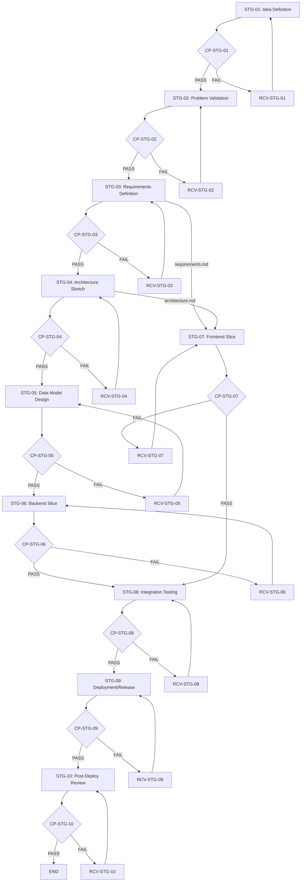

# Project Stage Map — Image Upload & Download Service

## Document Metadata

```yaml
project_id: PRJ-001
document_id: project-stage-map
version: v0.1.0
timestamp: 2026-02-15T12:00:00Z
```

---

## 1. Project Goal

Build a web page where users can upload images and download them from anywhere via a unique URL.

---

## 2. Stage List

| stage_no | stage_id | Purpose | Key Artifact |
|----------|----------|---------|--------------|
| 1 | STG-01 | Define the problem to solve and the project goal | idea-brief.md |
| 2 | STG-02 | Validate problem priority and feasibility | problem-validation.md |
| 3 | STG-03 | Structure functional and non-functional requirements | requirements.md |
| 4 | STG-04 | Design system architecture and responsibility boundaries | architecture.md |
| 5 | STG-05 | Define core entities, relationships, and constraints | schema.mmd |
| 6 | STG-06 | Implement core API and business logic | backend-slice/ |
| 7 | STG-07 | Implement user-facing UI flow | frontend-slice/ |
| 8 | STG-08 | Verify system integration quality | integration-test-report.json |
| 9 | STG-09 | Execute deployment and release verification | release-note.md |
| 10 | STG-10 | Review operational metrics and confirm improvements | post-deploy-review.md |

---

## 3. Dependency Matrix

| stage_id | Predecessor | Required Artifact | Dependency Basis |
|----------|-------------|-------------------|------------------|
| STG-01 | - | - | Start stage (no predecessor) |
| STG-02 | STG-01 | idea-brief.md | Problem definition needed for validation |
| STG-03 | STG-02 | problem-validation.md | Validated problem needed for requirements |
| STG-04 | STG-03 | requirements.md | Requirements needed for architecture design |
| STG-05 | STG-04 | architecture.md | Architecture needed for data model design |
| STG-06 | STG-03, STG-05 | requirements.md, schema.mmd | Requirements + schema needed for backend |
| STG-07 | STG-03, STG-04 | requirements.md, architecture.md | Requirements + architecture needed for frontend |
| STG-08 | STG-06, STG-07 | backend-slice/, frontend-slice/ | Both slices needed for integration test |
| STG-09 | STG-08 | integration-test-report.json | Test report needed for deployment decision |
| STG-10 | STG-09 | release-note.md | Release info needed for post-deploy review |

---

## 4. Branch Rules

| stage_id | checkpoint_id | PASS → Next Stage | FAIL → Recovery Path |
|----------|---------------|-------------------|----------------------|
| STG-01 | CP-STG-01 | STG-02 | RCV-STG-01 |
| STG-02 | CP-STG-02 | STG-03 | RCV-STG-02 |
| STG-03 | CP-STG-03 | STG-04 | RCV-STG-03 |
| STG-04 | CP-STG-04 | STG-05 | RCV-STG-04 |
| STG-05 | CP-STG-05 | STG-06 | RCV-STG-05 |
| STG-06 | CP-STG-06 | STG-08 (wait for STG-07) | RCV-STG-06 |
| STG-07 | CP-STG-07 | STG-08 (wait for STG-06) | RCV-STG-07 |
| STG-08 | CP-STG-08 | STG-09 | RCV-STG-08 |
| STG-09 | CP-STG-09 | STG-10 | RCV-STG-09 |
| STG-10 | CP-STG-10 | END | RCV-STG-10 |

---

## 5. Flow Diagram



---

## Self-Validation

- [x] All stages have a unique stage_id.
- [x] All dependencies are described in terms of Artifacts (not activity order).
- [x] No stage is missing a PASS/FAIL branch rule.
- [x] No FAIL branch exists without a Recovery path.
- [x] No direct Artifact dependency between parallel stages (STG-06 and STG-07).
- [x] No circular dependencies exist.
