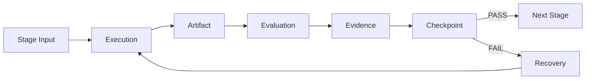
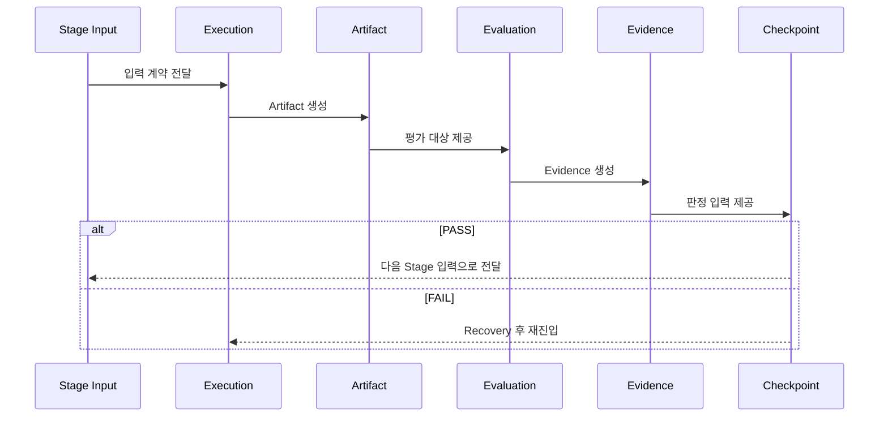

# ⚙️ Flow Architecture — 스테이지 내부 흐름 구조

## 1. 개요

이 문서는 단일 스테이지 내부에서
**Execution → Artifact → Evaluation → Evidence → Checkpoint**
흐름이 어떻게 연결되고 데이터가 어떻게 전달되는지를 정의한다.

각 요소의 상세 정의는 `07_reference/` 문서를 참조한다.
이 문서는 요소 간 **연결 구조와 계약 관계**에 집중한다.

---

## 2. 전체 흐름



---

## 3. 요소 간 입출력 계약

### 3.1 Stage Input → Execution

| 항목 | 설명 |
|------|------|
| 입력 | 선행 Artifact, Evidence, 요구사항, 정책, 제약 조건 |
| 계약 | 입력 형식 명시, 버전 식별 가능, 참조 가능 |
| 위반 시 | Execution 진입 불가 |

---

### 3.2 Execution → Artifact

| 항목 | 설명 |
|------|------|
| 입력 | Stage Input + Execution 활동 |
| 출력 | 검증 가능한 Artifact |
| 계약 | Artifact는 명시적 구조, 계약 준수, 평가 가능 상태 |
| 위반 시 | Artifact 미생성 → Evaluation 진입 불가 |

핵심 원칙:

- Execution은 Artifact를 생성하는 것이 유일한 목적이다
- Execution 단계에서 PASS/FAIL 판정은 금지된다

---

### 3.3 Artifact → Evaluation

| 항목 | 설명 |
|------|------|
| 입력 | Artifact + 평가 기준 + 정책 + 품질 임계값 |
| 출력 | 평가 결과 (PASS / FAIL), 평가 리포트, 품질 지표 |
| 계약 | Artifact는 평가 가능 상태여야 함 |
| 위반 시 | Evaluation 수행 불가 |

Evaluation 유형:

- 계약 검증 (Contract Evaluation)
- 품질 검증 (Quality Evaluation)
- 정책 검증 (Policy Evaluation)
- 휴먼 리뷰 (Human Evaluation)
- 에이전트 평가 (Agent Evaluation)

---

### 3.4 Evaluation → Evidence

| 항목 | 설명 |
|------|------|
| 입력 | Evaluation 수행 결과 |
| 출력 | 객관적, 재현 가능한 Evidence |
| 계약 | Evidence는 Evaluation과 1:1 대응, 출처 명확, 시점 기록, 변조 방지 |
| 위반 시 | 근거 없는 Evaluation → 무효 |

Evidence 라이프사이클:

```
생성 → 기록 → 고정(Frozen) → 참조 → 감사/분석
```

고정 이후 임의 수정은 금지된다.

---

### 3.5 Evidence → Checkpoint

| 항목 | 설명 |
|------|------|
| 입력 | Artifact + Evaluation 결과 + Evidence |
| 출력 | PASS / FAIL 판정 + 상태 전이 결과 |
| 계약 | 판정은 명시적 정책 기반, 근거 필수 |
| 위반 시 | 정책 없는 Checkpoint → SSDAM 위반 |

Checkpoint 판정 기준:

- Artifact 존재 여부만으로 판정 ❌
- Activity 수행 여부만으로 판정 ❌
- Evidence 충족 여부로 판정 ✅

---

### 3.6 Checkpoint → 분기

**PASS 경로:**

```
Checkpoint PASS → Stage 상태 COMPLETED → Next Stage READY
```

전달 항목:
- 검증된 Artifact
- 생성된 Evidence
- Checkpoint 판정 기록

**FAIL 경로:**

```
Checkpoint FAIL → Stage 상태 FAILED → Recovery 진입
```

전달 항목:
- 실패 사유
- 보존된 Evidence
- 기존 Artifact (변경 없이 유지)

---

### 3.7 Recovery → Execution (재진입)

| 항목 | 설명 |
|------|------|
| 입력 | 실패 분류 결과, Recovery 전략, 기존 Artifact/Evidence |
| 출력 | 수정/재생성된 Artifact, Recovery Evidence |
| 계약 | 실패 원인 분류 완료, 전략 선택 근거 명시, FAIL 기록 보존 |
| 위반 시 | 재진입 불가 |

Recovery는 기존 흐름을 덮어쓰지 않는다.
FAIL 기록과 기존 Evidence는 보존된 채 새로운 실행 사이클이 시작된다.

---

## 4. 시퀀스 다이어그램



---

## 5. 데이터 흐름 요약

```
Stage Input
  │
  ├─ 선행 Artifact
  ├─ 관련 Evidence
  ├─ 요구사항 / 정책
  │
  ▼
Execution ──────────► Artifact
                         │
                         ├─ 검증 가능한 산출물
                         │
                         ▼
                     Evaluation
                         │
                         ├─ PASS / FAIL 판정
                         ├─ 품질 지표
                         │
                         ▼
                     Evidence
                         │
                         ├─ 객관적 근거
                         ├─ 측정값 / 로그 / 리뷰
                         │
                         ▼
                     Checkpoint
                         │
                    ┌────┴────┐
                  PASS      FAIL
                    │         │
              Next Stage   Recovery
```

---

## 6. 불변 규칙

- 요소 순서 변경 금지 (Execution → Artifact → Evaluation → Evidence → Checkpoint)
- 요소 생략 금지 (Evaluation 없이 Checkpoint 진행 불가)
- 역방향 데이터 흐름 금지 (Checkpoint → Artifact 직접 수정 불가)
- Recovery를 제외한 재진입 경로 금지

---

## 7. 안티패턴

❌ Execution에서 바로 Checkpoint — Evaluation/Evidence 생략
❌ Artifact 없이 Evaluation 수행 — 평가 대상 부재
❌ Evidence 없이 Checkpoint 판정 — 근거 없는 승인
❌ Recovery 없이 FAIL 후 다음 Stage 진행 — 실패 무시
❌ Checkpoint 결과를 소급하여 Artifact 수정 — 추적성 훼손

---

## ✅ 핵심 요약

스테이지 내부 흐름은:

> **"순차 작업 목록"이 아니라
> "계약으로 연결된 검증 파이프라인"**

각 요소는 독립적 책임을 가지되,
선행 요소의 출력이 후행 요소의 입력 계약을 충족해야만 진행이 허용된다.
