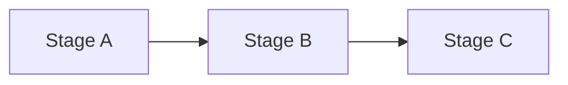
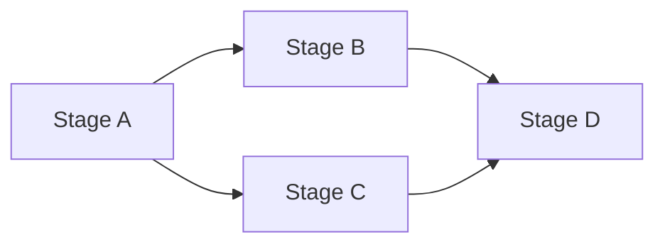
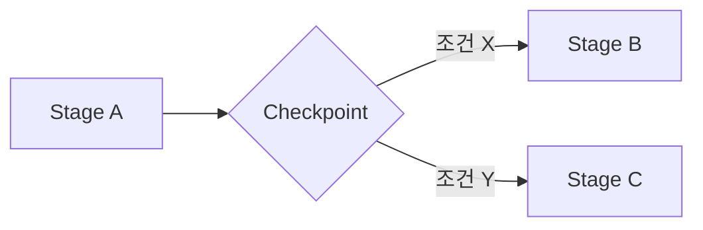
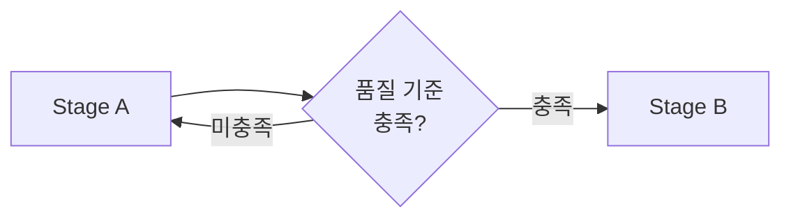
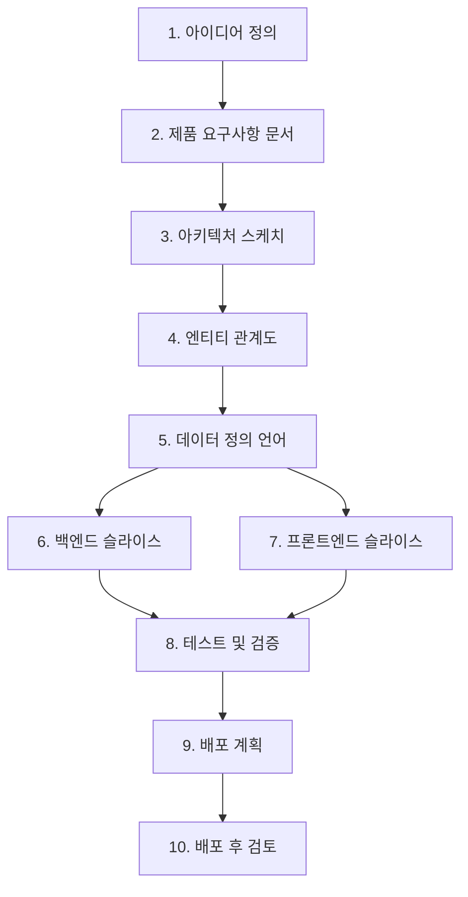

# 🧩 Stage Composition — 스테이지 조합 패턴

## 1. 개요

이 문서는 SSDAM에서 독립적으로 설계된 스테이지들을
**어떻게 연결·조합하여 전체 실행 흐름을 구성하는지**를 정의한다.

SSDAM 설계 목표의 "조합 가능한 스테이지 아키텍처"를 구체화하며,
SOLID 원칙 중 리스코프 치환 원칙(L)과 인터페이스 분리 원칙(I)의
실제 적용 방식을 다룬다.

---

## 2. 조합 전제 조건

스테이지가 조합 가능하려면 다음을 충족해야 한다:

| 조건 | 설명 |
|------|------|
| 단일 목적 | 스테이지 내부 로직이 하나의 목적에 집중 |
| 명시적 계약 | 입력/출력이 명확히 정의됨 |
| 독립성 | 다른 스테이지의 내부 구현에 의존하지 않음 |
| 치환 가능성 | 동일 계약을 충족하는 다른 스테이지로 교체 가능 |

---

## 3. 조합 패턴

### 3.1 순차 조합 (Sequential)

가장 기본적인 패턴. 선행 스테이지의 출력이 후행 스테이지의 입력이 된다.



연결 규칙:

- Stage A의 출력 계약 = Stage B의 입력 계약
- Stage A가 COMPLETED 상태여야 Stage B 진입 가능
- 중간 스테이지 생략 금지

적용 예시:

```
요구사항 정의 → 아키텍처 스케치 → 데이터 설계 → 백엔드 구현 → 테스트
```

---

### 3.2 병렬 조합 (Parallel)

독립적인 스테이지가 동시에 실행되고,
모든 병렬 스테이지가 COMPLETED되어야 후속 스테이지가 진입 가능하다.



연결 규칙:

- 병렬 스테이지 간 입력/출력 계약 충돌 금지
- 병렬 스테이지는 서로의 Artifact에 의존하지 않음
- 합류 스테이지(Stage D)는 모든 선행 스테이지의 COMPLETED를 대기

적용 예시:

```
아키텍처 스케치 완료 후:
  ├─ 백엔드 슬라이스 (병렬)
  └─ 프론트엔드 슬라이스 (병렬)
      └─ 통합 테스트 (합류)
```

---

### 3.3 조건부 조합 (Conditional)

Checkpoint 결과 또는 Artifact 속성에 따라
다음 스테이지가 분기되는 패턴.



연결 규칙:

- 분기 조건은 명시적 정책으로 정의
- 각 분기 경로의 입력 계약이 Stage A 출력과 호환
- 암묵적 분기 금지 (모든 경로가 사전 정의)

적용 예시:

```
테스트 및 검증 Checkpoint 후:
  ├─ PASS + 고위험 플래그 → 보안 감사 스테이지
  └─ PASS + 일반 → 배포 계획 스테이지
```

---

### 3.4 반복 조합 (Iterative)

동일 스테이지를 조건 충족까지 반복 실행하는 패턴.
Recovery와 구분된다 — 반복 조합은 **설계된 반복**이며,
Recovery는 **실패 후 회복**이다.



연결 규칙:

- 최대 반복 횟수 정의 필수
- 반복마다 Evidence 누적
- 최대 횟수 초과 시 에스컬레이션

적용 예시:

```
프로토타입 검증:
  반복 실행 (최대 3회) → 품질 기준 충족 시 → 본구현 스테이지
```

---

## 4. 스테이지 치환 (Liskov Substitution)

SOLID의 리스코프 치환 원칙에 따라,
동일 계약을 충족하는 스테이지는 서로 교체 가능해야 한다.

### 4.1 치환 조건

| 조건 | 설명 |
|------|------|
| 입력 계약 호환 | 원본과 동일하거나 더 넓은 입력 수용 |
| 출력 계약 호환 | 원본과 동일하거나 더 좁은 출력 생성 |
| Artifact 형식 유지 | 후행 스테이지가 기대하는 형식 충족 |
| 평가 기준 호환 | 동일 Evaluation 기준 적용 가능 |

### 4.2 치환 예시

원본:

```
데이터 설계 (수동 ERD 작성)
  입력: 요구사항 문서
  출력: schema.mmd
```

치환:

```
데이터 설계 (AI 지원 ERD 생성)
  입력: 요구사항 문서
  출력: schema.mmd
```

입력/출력 계약이 동일하므로 치환 가능하다.
내부 Execution 방식(수동 vs AI)은 조합 구조에 영향을 주지 않는다.

---

## 5. 계약 설계 원칙 (Interface Segregation)

SOLID의 인터페이스 분리 원칙에 따라,
스테이지 간 계약은 최소 단위로 정의해야 한다.

### 5.1 규칙

- 하나의 계약에 여러 관심사를 혼합하지 않는다
- 후행 스테이지가 사용하지 않는 출력을 강제하지 않는다
- 입력 계약은 해당 스테이지가 실제로 필요한 항목만 포함한다

### 5.2 좋은 예

```
Stage: 백엔드 슬라이스
  입력 계약: schema.mmd, api-spec.yaml
  출력 계약: compiled-code, test-report.json
```

각 Artifact가 명확한 단일 역할을 가진다.

### 5.3 나쁜 예

```
Stage: 백엔드 슬라이스
  입력 계약: project-bundle.zip (요구사항 + 설계 + 환경설정 + 회의록 포함)
```

하나의 번들에 모든 것을 넣으면
계약 검증이 불가능하고 의존성이 불투명해진다.

---

## 6. 실전 조합 예시

SSDAM.md에서 정의된 예시 스테이지를 조합 패턴으로 구성한다.



조합 패턴 분석:

| 구간 | 패턴 | 설명 |
|------|------|------|
| S1 → S5 | 순차 | 정의 → 설계 흐름 |
| S5 → S6, S7 | 병렬 | 백엔드/프론트엔드 동시 진행 |
| S6, S7 → S8 | 합류 | 통합 테스트 |
| S8 → S10 | 순차 | 배포 흐름 |

---

## 7. 조합 불변 규칙

- 계약 없는 스테이지 연결 금지
- 스테이지 내부 구현에 의존하는 연결 금지 (의존성 역전 원칙)
- 암묵적 분기/합류 금지 (모든 경로 사전 정의)
- 순환 참조 금지 (반복 조합은 명시적 탈출 조건 필수)
- 병렬 스테이지 간 Artifact 직접 공유 금지

---

## 8. 안티패턴

❌ 거대 스테이지 — 다중 목적을 하나의 스테이지에 묶음
❌ 암묵적 의존 — 계약 없이 선행 스테이지의 내부 상태에 의존
❌ 분기 누락 — 조건부 경로를 정의하지 않고 런타임에 결정
❌ 무한 반복 — 탈출 조건/최대 횟수 없는 반복 조합
❌ 번들 계약 — 하나의 입력에 모든 정보를 묶어 전달

---

## ✅ 핵심 요약

스테이지 조합은:

> **"순서대로 나열하는 것"이 아니라
> "계약 기반으로 독립적 목적 단위를 연결하는 설계 행위"**

SSDAM에서 조합 가능성은:

- 계약 명확성에 의존하며
- SOLID 원칙 준수로 보장되고
- 치환·확장·분기가 구조적으로 허용되는 아키텍처 특성이다.