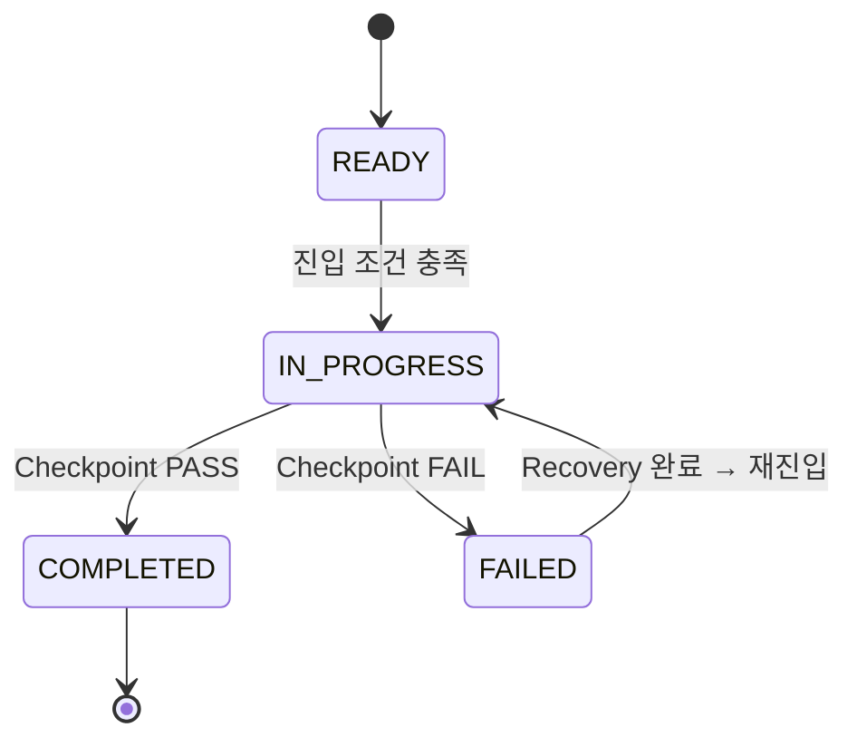

# 🔄 Stage Lifecycle — 스테이지 상태 머신

## 1. 개요

이 문서는 SSDAM 스테이지의 **상태(State)**, **전이(Transition)**, **전이 조건(Guard)**을
정의한다.

스테이지는 단순한 작업 흐름이 아니라
**검증 기반 상태 전이 모델**로 작동한다.

---

## 2. 상태 정의

| 상태 | 설명 |
|------|------|
| **READY** | 선행 조건 충족, 실행 대기 |
| **IN_PROGRESS** | 실행 중 (Execution → Artifact → Evaluation → Evidence) |
| **COMPLETED** | Checkpoint PASS로 종료 |
| **FAILED** | Checkpoint FAIL로 종료 |

---

## 3. 상태 전이 다이어그램

---

## 4. 전이 조건 (Guards)

### 4.1 READY → IN_PROGRESS

진입 조건:

- 선행 스테이지 COMPLETED (최초 스테이지 제외)
- 입력 Artifact 존재
- 입력 계약 충족
- 필요 리소스 확보

위반 시:

→ 진입 불가, READY 유지

---

### 4.2 IN_PROGRESS → COMPLETED

전이 조건:

- Artifact 생성 완료
- Evaluation 수행 완료
- Evidence 확보 완료
- Checkpoint PASS 판정

**모든 조건이 충족되어야 전이 가능**

---

### 4.3 IN_PROGRESS → FAILED

전이 조건 (하나 이상 충족 시):

- 평가 기준 미충족
- 산출물 계약 위반
- 필수 근거 누락
- 품질 임계값 미달
- 위험 수준 허용치 초과

FAIL 판정 시 필수 행위:

1. 실패 사유 기록
2. Evidence 보존
3. Recovery 전략 결정

---

### 4.4 FAILED → IN_PROGRESS (Recovery 재진입)

재진입 조건:

- 실패 원인 분류 완료
- Recovery 전략 선택 및 실행
- Recovery Artifact 생성
- Recovery Evidence 기록
- 재진입 판단 근거 확보

재진입 불가 시:

→ FAILED 유지, 에스컬레이션 수행

---

## 5. 에스컬레이션 규칙

다음 조건 시 사람 개입이 필수이다:

| 조건 | 행동 |
|------|------|
| 동일 실패 반복 (N회 이상) | 사람 판단 요청 |
| 불확실성 임계 초과 | 사람 체크포인트 승격 |
| 근거 간 충돌 | 사람 중재 |
| Recovery 전략 소진 | 사람 재설계 판단 |

N의 기본값은 프로젝트 정책으로 정의한다.

---

## 6. 상태 불변 규칙

- READY에서 COMPLETED로 직접 전이 금지
- READY에서 FAILED로 직접 전이 금지
- IN_PROGRESS를 거치지 않는 종료 금지
- COMPLETED에서 FAILED로 역전이 금지
- 상태 전이 기록 누락 금지

---

## 7. 추적성 요구사항

모든 상태 전이는 다음을 기록해야 한다:

| 항목 | 설명 |
|------|------|
| 전이 시점 | Timestamp |
| 이전 상태 | FROM State |
| 이후 상태 | TO State |
| 전이 근거 | Checkpoint 결과 / Recovery 결과 |
| 수행 주체 | Human / Agent / Policy |

---

## 8. 안티패턴

❌ 암묵적 전이 — 기록 없이 상태 변경
❌ 조건 생략 전이 — Guard 무시 후 진행
❌ 무한 Recovery 루프 — 에스컬레이션 없는 반복 재시도
❌ 상태 건너뛰기 — READY에서 COMPLETED 직행

---

## ✅ 핵심 요약

스테이지 상태 머신은:

> **"흐름 제어 장치"가 아니라
> "검증 기반 상태 전이의 결정적 규칙 집합"**

SSDAM에서 스테이지 진행은:

- 활동 완료 ❌
- 시간 경과 ❌
- **검증된 조건 충족 ✅**으로만 허용된다.
