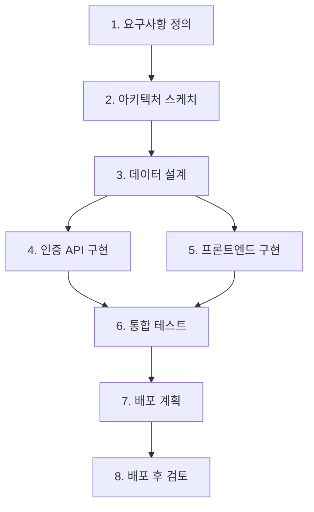

# 📋 Project Planning Guide — 프로젝트 계획 가이드

## 1. 개요

이 문서는 프로젝트 목표를 **SSDAM 스테이지로 분해하고 전체 실행 흐름을 구성하는 절차**를 정의한다.

개별 스테이지 설계는 `03_methodology/stage-design-guide.md`를 따르며,
이 문서는 **스테이지 간 관계와 프로젝트 수준 정책**에 집중한다.

계획 절차:

```
목표 분해 → 스테이지 식별 → 의존성 분석 → 조합 구성 → 정책 수립 → 계획 검증
```

---

## 2. Step 1 — 목표 분해

프로젝트의 최종 목표를 **독립적으로 검증 가능한 하위 목표**로 분해한다.

### 2.1 분해 기준

| 기준 | 질문 |
|------|------|
| 검증 가능성 | 이 목표가 달성되었는지 객관적으로 판단할 수 있는가? |
| 독립성 | 이 목표가 다른 목표와 분리되어 완료될 수 있는가? |
| 산출물 존재 | 이 목표의 달성 결과가 구체적 Artifact로 표현되는가? |

### 2.2 분해 절차

1. 최종 목표를 기술한다
2. "이 목표를 달성하려면 무엇이 먼저 검증되어야 하는가?"를 반복 질문한다
3. 더 이상 분해할 수 없거나, 단일 목적으로 귀결될 때 멈춘다
4. 각 하위 목표가 위 기준을 충족하는지 확인한다

### 2.3 예시

최종 목표: "사용자 인증 기능이 포함된 웹 애플리케이션 배포"

```
웹 애플리케이션 배포
├─ 요구사항이 정의되었는가?
├─ 아키텍처가 검증되었는가?
├─ 데이터 구조가 확정되었는가?
├─ 인증 API가 구현/검증되었는가?
├─ 프론트엔드가 구현/검증되었는가?
├─ 통합 테스트가 통과되었는가?
├─ 배포 계획이 수립되었는가?
└─ 배포 후 안정성이 확인되었는가?
```

### 2.4 안티패턴

- ❌ "백엔드 완성" → 검증 기준 불명확, 추가 분해 필요
- ❌ "좋은 UX 만들기" → 산출물 불명확, 구체화 필요
- ✅ "인증 API 엔드포인트 구현 및 테스트 통과" → 검증 가능, 산출물 명확

---

## 3. Step 2 — 스테이지 식별

분해된 하위 목표를 **SSDAM 스테이지로 변환**한다.

### 3.1 변환 규칙

각 하위 목표에 대해 다음을 확인한다:

| 조건 | 충족 여부 |
|------|----------|
| 단일 목적인가? | 두 가지 이상이면 분리 |
| Artifact를 생성하는가? | 없으면 스테이지가 아님 |
| Checkpoint로 종료 가능한가? | 불가능하면 재정의 |
| 입출력 계약이 정의 가능한가? | 불가능하면 범위 조정 |

### 3.2 스테이지 목록 작성

| # | 스테이지 | 목적 | 주요 Artifact |
|---|---------|------|--------------|
| 1 | 요구사항 정의 | 제품 요구사항 구조화 | requirements.md |
| 2 | 아키텍처 스케치 | 시스템 구조 설계 | architecture.md |
| 3 | 데이터 설계 | 엔티티 관계 구조화 | schema.mmd |
| 4 | 인증 API 구현 | 인증 엔드포인트 구현 | auth-api (code) |
| 5 | 프론트엔드 구현 | UI 컴포넌트 구현 | frontend (code) |
| 6 | 통합 테스트 | 전체 시스템 검증 | test-report.json |
| 7 | 배포 계획 | 배포 절차 수립 | deploy-plan.md |
| 8 | 배포 후 검토 | 운영 안정성 확인 | post-deploy-report.md |

### 3.3 검증 질문

- 모든 하위 목표가 스테이지로 변환되었는가?
- 스테이지 없이 건너뛰는 목표가 있지 않은가?
- 하나의 스테이지에 두 개 이상의 목적이 혼합되어 있지 않은가?

---

## 4. Step 3 — 의존성 분석

스테이지 간 **선후 관계와 데이터 의존성**을 분석한다.

### 4.1 의존성 매트릭스

| 스테이지 | 선행 필요 | 필요 Artifact |
|---------|----------|--------------|
| 요구사항 정의 | — (시작점) | — |
| 아키텍처 스케치 | 요구사항 정의 | requirements.md |
| 데이터 설계 | 아키텍처 스케치 | architecture.md |
| 인증 API 구현 | 데이터 설계 | schema.mmd |
| 프론트엔드 구현 | 데이터 설계 | schema.mmd, architecture.md |
| 통합 테스트 | 인증 API + 프론트엔드 | auth-api, frontend |
| 배포 계획 | 통합 테스트 | test-report.json |
| 배포 후 검토 | 배포 계획 | deploy-plan.md |

### 4.2 분석 규칙

- 의존성은 Artifact 기반으로 판단한다 (활동 순서가 아님)
- 서로의 Artifact를 참조하지 않는 스테이지는 병렬 후보이다
- 순환 의존이 발견되면 스테이지 범위를 재조정한다

### 4.3 안티패턴

- ❌ 암묵적 의존 — "당연히 이 다음이니까"
- ❌ 활동 기반 순서 — "이 작업이 먼저니까"
- ✅ Artifact 기반 의존 — "이 스테이지는 schema.mmd가 필요하므로"

---

## 5. Step 4 — 조합 구성

의존성 분석 결과를 바탕으로 `02_architecture/stage-composition.md`의
**조합 패턴을 적용**하여 전체 흐름을 구성한다.

### 5.1 패턴 적용 절차

1. 의존성 매트릭스에서 선형 의존을 식별한다 → **순차 조합**
2. 동일 선행 조건에서 분기되는 독립 스테이지를 식별한다 → **병렬 조합**
3. Checkpoint 결과에 따라 경로가 달라지는 지점을 식별한다 → **조건부 조합**
4. 품질 기준 미달 시 반복이 필요한 스테이지를 식별한다 → **반복 조합**

### 5.2 흐름도 작성

위 예시에 적용:



패턴 요약:

| 구간 | 패턴 |
|------|------|
| S1 → S3 | 순차 |
| S3 → S4, S5 | 병렬 |
| S4, S5 → S6 | 합류 |
| S6 → S8 | 순차 |

### 5.3 검증 질문

- 모든 스테이지가 흐름도에 포함되어 있는가?
- 병렬 스테이지 간 Artifact 직접 의존이 없는가?
- 합류 지점에서 모든 선행 스테이지의 COMPLETED를 대기하는가?
- 순환 경로가 없는가?

---

## 6. Step 5 — 프로젝트 수준 정책 수립

개별 스테이지 정책 외에 **프로젝트 전체에 적용되는 정책**을 정의한다.

### 6.1 Recovery 정책

| 항목 | 정의 |
|------|------|
| 기본 최대 Recovery 횟수 | 스테이지당 기본값 (예: 3회) |
| 에스컬레이션 기준 | 연속 FAIL N회 시 사람 개입 |
| Rollback 허용 범위 | 최대 몇 스테이지까지 롤백 가능 |

### 6.2 품질 정책

| 항목 | 정의 |
|------|------|
| 전체 테스트 커버리지 기준 | 예: ≥ 80% |
| 보안 스캔 정책 | 예: Critical 0건 |
| 코드 리뷰 정책 | 예: 최소 1인 승인 |

### 6.3 에이전트 정책

| 항목 | 정의 |
|------|------|
| 에이전트 허용 역할 | Execution / Evaluation / Recovery 중 허용 범위 |
| 사람 승인 필수 스테이지 | 예: 아키텍처 스케치, 배포 계획 |
| 에이전트 평가 신뢰도 임계값 | 예: Confidence ≥ 0.85 |
| 에스컬레이션 불확실성 기준 | 예: Uncertainty > 0.3 |

### 6.4 추적성 정책

| 항목 | 정의 |
|------|------|
| 변경 이력 보존 기간 | 예: 프로젝트 종료 후 1년 |
| Evidence 저장소 | 예: Git Repository / Artifact Store |
| 감사 대응 준비 수준 | 예: 모든 Checkpoint 기록 영구 보존 |

---

## 7. Step 6 — 계획 검증

전체 계획이 완성되면 다음 체크리스트로 최종 검증한다.

### 7.1 프로젝트 계획 체크리스트

**목표 분해**

- [ ] 최종 목표가 명확히 기술되어 있다
- [ ] 하위 목표가 검증 가능한 단위로 분해되어 있다
- [ ] 누락된 하위 목표가 없다

**스테이지 식별**

- [ ] 모든 하위 목표가 스테이지로 변환되어 있다
- [ ] 각 스테이지가 단일 목적을 가진다
- [ ] 각 스테이지의 Artifact가 식별되어 있다

**의존성**

- [ ] 의존성이 Artifact 기반으로 정의되어 있다
- [ ] 순환 의존이 없다
- [ ] 암묵적 의존이 없다

**조합**

- [ ] 조합 패턴이 명시되어 있다
- [ ] 병렬 스테이지 간 독립성이 확인되어 있다
- [ ] 합류 조건이 정의되어 있다

**정책**

- [ ] Recovery 정책이 수립되어 있다
- [ ] 품질 정책이 수립되어 있다
- [ ] 에이전트 정책이 수립되어 있다
- [ ] 추적성 정책이 수립되어 있다

**SSDAM 호환성**

- [ ] 모든 스테이지가 개별 설계 검증을 통과한다
  (stage-design-guide.md 체크리스트 참조)
- [ ] 전체 흐름이 02_architecture 불변 규칙을 위반하지 않는다
- [ ] 01_principles의 10개 원칙과 충돌이 없다

---

## 8. 계획 템플릿

```md
# Project: [프로젝트 이름]

## 최종 목표
[한 문장으로 기술]

## 스테이지 목록
| # | 스테이지 | 목적 | 주요 Artifact |
|---|---------|------|--------------|

## 의존성 매트릭스
| 스테이지 | 선행 필요 | 필요 Artifact |
|---------|----------|--------------|

## 흐름도
[Mermaid 다이어그램]

## 조합 패턴 요약
| 구간 | 패턴 |
|------|------|

## 프로젝트 정책
### Recovery
### 품질
### 에이전트
### 추적성
```

---

## ✅ 핵심 요약

프로젝트 계획은:

> **"할 일 목록 작성"이 아니라
> "검증 가능한 목적 단위를 계약으로 연결하고
> 정책으로 통제하는 설계 행위"**

SSDAM에서 좋은 프로젝트 계획은:

- 모든 스테이지가 독립적으로 설계 검증을 통과하고
- 스테이지 간 연결이 계약으로 명시되어 있으며
- 실패와 회복이 사전에 설계되어 있는 계획이다.
