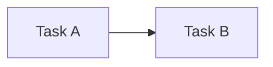

# 🔗 Dependency Model — Task Dependency Structure

## 1. Overview

This document defines the **dependency relationships between Tasks**
within SSDAM.

Dependencies determine:

- Execution ordering
- Readiness conditions
- BLOCKED states
- Recovery propagation
- Deterministic flow control

SSDAM treats dependencies as **explicit structural contracts**,  
not implicit assumptions.

---

## 2. Dependency Definition

**Task Dependency:**

> A rule that constrains when a Task may enter READY or IN_PROGRESS
> based on the state, artifacts, or decisions of other Tasks.

---

## 3. Dependency Types

### 3.1 Sequential Dependency

Task B requires Task A to PASS before execution.

**Rules:**

- A must reach PASS
- A’s Output Contract must satisfy B’s Input Contract

---

### 3.2 Data Dependency

Task depends on a specific Artifact.

Example:

Task B requires:

- schema.mmd
- api-spec.yaml

**Rules:**

- Artifact must exist
- Artifact Contract validated

---

### 3.3 Evidence Dependency

Task requires validated Evidence.

Example:

Deployment Task requires:

- Testing Evidence
- Security Evidence

---

### 3.4 Policy Dependency

Execution allowed only after policy decision.

Example:

Release Task requires:

- Compliance Approval
- Risk Acceptance Decision

---

### 3.5 Soft Dependency

Dependency that may be bypassed under policy.

Example:

Performance Optimization (optional)

---

### 3.6 Hard Dependency

Dependency that **must not be bypassed**.

Example:

Security Validation before Production Deployment

---

## 4. Dependency Graph Model

SSDAM dependency structure forms a:

> **Directed Acyclic Graph (DAG)**

Properties:

- No circular dependencies
- Deterministic execution ordering
- Explicit dependency edges

---

## 5. BLOCKED State Conditions

A Task enters **BLOCKED** when:

- Required dependency not satisfied
- Required Artifact missing
- Policy gate unresolved
- Upstream Task FAILED

---

## 6. Dependency Violation Handling

Violation triggers:

1. BLOCKED state transition
2. Violation record creation
3. Evidence capture (if applicable)
4. Recovery / Escalation

---

## 7. Recovery Propagation Rules

Failures propagate depending on dependency type:

| Dependency Type | Propagation Behavior |
|-----------------|----------------------|
| Sequential | Downstream Tasks BLOCKED |
| Data | Consumers BLOCKED |
| Evidence | Decision gates invalidated |
| Policy | Execution denied |
| Soft | Policy-dependent |
| Hard | Mandatory BLOCKED |

---

## 8. Circular Dependency Prohibition

Circular Task dependencies are forbidden.

❌ A → B → C → A

**Reason:**

Breaks determinism  
Creates deadlocks  
Invalidates readiness evaluation

---

## 9. Dependency Resolution Strategies

Examples:

- Upstream Recovery
- Artifact regeneration
- Task substitution
- Dependency relaxation (Soft only)
- Mission-level redesign

---

## 10. Readiness Evaluation

Task READY requires:

- All Hard Dependencies satisfied
- Required Artifacts available
- Required Evidence validated
- Policy gates resolved

---

## 11. Anti-Patterns

❌ Implicit dependencies  
❌ Hidden Artifact coupling  
❌ Circular dependencies  
❌ Soft/Hard ambiguity  
❌ Dependency without Contract  

---

## ✅ Key Summary

SSDAM Dependency Model ensures:

- Deterministic execution ordering
- Explicit readiness rules
- Controlled BLOCKED states
- Predictable failure propagation

Dependencies are:

> **First-class architectural elements —
> not workflow annotations.**
