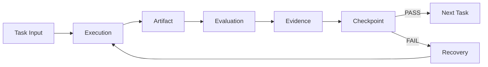
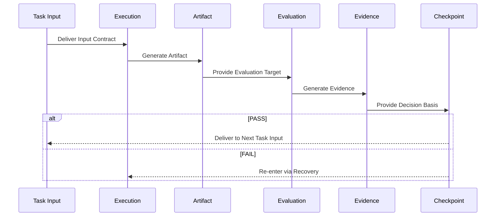

# ⚙️ Flow Architecture — Internal Task Flow Structure

## 1. Overview

This document defines how, within a single **Task**, the

**Execution → Artifact → Evaluation → Evidence → Checkpoint**

flow is connected and how data is transferred between elements.

For detailed definitions of each element, refer to `05_references/`.
This document focuses on **connection structure and contractual relationships**.

---

## 2. Overall Flow

---

## 3. Input/Output Contracts Between Elements

### 3.1 Task Input → Execution

| Item | Description |
|------|-------------|
| Input | Preceding Artifacts, Evidence, Requirements, Policies, Constraints |
| Contract | Input format must be defined, versioned, referencable |
| On Violation | Execution entry denied |

---

### 3.2 Execution → Artifact

| Item | Description |
|------|-------------|
| Input | Task Input + Execution activities |
| Output | Verifiable Artifact |
| Contract | Artifact must be structured, Contract-compliant, evaluable |
| On Violation | Artifact invalid → Evaluation denied |

**Core Principles:**

- Execution exists solely to generate Artifacts  
- PASS / FAIL judgments prohibited during Execution  

---

### 3.3 Artifact → Evaluation

| Item | Description |
|------|-------------|
| Input | Artifact + Evaluation Criteria + Policies + Quality Threshold |
| Output | Evaluation Result (PASS / FAIL), Metrics, Reports |
| Contract | Artifact must be evaluable |
| On Violation | Evaluation denied |

**Evaluation Types:**

- Contract Evaluation  
- Quality Evaluation  
- Policy Evaluation  
- Human Evaluation  
- Agent Evaluation  

---

### 3.4 Evaluation → Evidence

| Item | Description |
|------|-------------|
| Input | Evaluation Results |
| Output | Objective, reproducible Evidence |
| Contract | Evidence must map to Evaluation, include source & timestamp |
| On Violation | Evidence missing → Evaluation invalid |

**Evidence Lifecycle:**

Generated → Recorded → Frozen → Referenced → Audited

Frozen Evidence must not be modified arbitrarily.

---

### 3.5 Evidence → Checkpoint

| Item | Description |
|------|-------------|
| Input | Artifact + Evaluation Result + Evidence |
| Output | PASS / FAIL Decision + State Transition |
| Contract | Decision must be policy-defined & Evidence-backed |
| On Violation | Checkpoint invalid → SSDAM violation |

**Checkpoint Rules:**

- Decision based only on Artifact existence ❌  
- Decision based only on activity completion ❌  
- Decision based on Evidence satisfaction ✅  

---

### 3.6 Checkpoint → Branching

**PASS Path:**

Checkpoint PASS  
→ Task State = PASS  
→ Next Task READY

Delivered:

- Validated Artifact  
- Supporting Evidence  
- Decision Record  

---

**FAIL Path:**

Checkpoint FAIL  
→ Task State = FAILED  
→ Enter Recovery

Delivered:

- Failure Reason  
- Preserved Evidence  
- Existing Artifact (unchanged)  

---

### 3.7 Recovery → Execution (Re-entry)

| Item | Description |
|------|-------------|
| Input | Failure classification, Recovery strategy, Prior Artifacts/Evidence |
| Output | Modified / Re-generated Artifact, Recovery Evidence |
| Contract | Failure cause classified, strategy justified, history preserved |
| On Violation | Re-entry denied |

Recovery **does not overwrite** prior history.  
Previous FAIL context and Evidence remain preserved.

---

## 4. Sequence Diagram

---

## 5. Data Flow Summary

Task Input  
→ Execution  
→ Artifact  
→ Evaluation  
→ Evidence  
→ Checkpoint  

Checkpoint → PASS / FAIL → Next Task / Recovery

---

## 6. Invariant Rules

- Element order must not change  
  (Execution → Artifact → Evaluation → Evidence → Checkpoint)

- Elements must not be omitted  

- Reverse data flow prohibited  

- Re-entry allowed only via Recovery  

---

## 7. Anti-Patterns

❌ Execution → Direct Checkpoint  
❌ Evaluation without Artifact  
❌ Checkpoint without Evidence  
❌ FAIL → Next Task (skipping Recovery)  
❌ Retroactive Artifact modification

---

## ✅ Key Summary

The internal Task Flow is:

> **Not a sequential activity list,  
> but a contractually connected validation pipeline.**

Progression is allowed only when  
each element’s output satisfies the next element’s Contract.
