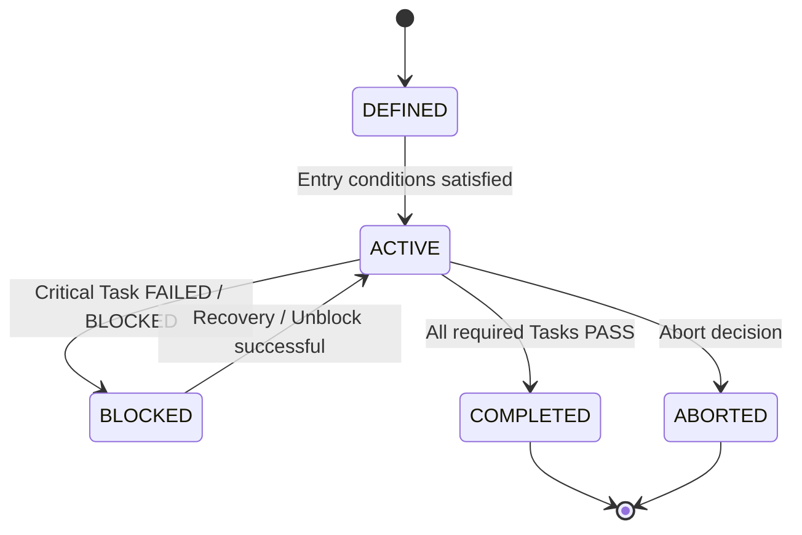

# 🚀 Mission Architecture — Mission Structure & Governance

## 1. Overview

This document defines the **structural role, lifecycle, and governance rules**
of a **Mission** in SSDAM.

A Mission represents a **unit of intent**, not execution.

While Tasks define execution and state transitions,
Missions define **direction, orchestration, and completion boundaries**.

---

## 2. Mission Definition

**Mission:**

> A higher-level intent container composed of multiple Tasks  
> executed in a defined structural relationship.

A Mission:

- Is **not directly executable**
- Does **not perform Execution**
- Governs Task composition and progression logic

---

## 3. Mission vs Task

| Element | Role |
|--------|------|
| **Mission** | Unit of intent / orchestration |
| **Task** | Unit of execution / validation |

**Key Rules:**

- Missions organize work
- Tasks perform work
- State transitions occur only at the **Task level**

---

## 4. Mission Responsibilities

A Mission defines:

- Intent / Objective
- Task composition structure
- Entry conditions
- Completion criteria
- Escalation boundaries
- Risk tolerance scope

---

## 5. Mission Lifecycle

| State | Description |
|------|-------------|
| **DEFINED** | Mission intent and Task structure declared |
| **ACTIVE** | One or more Tasks IN_PROGRESS |
| **BLOCKED** | Progress halted due to Task dependency/failure |
| **COMPLETED** | All required Tasks PASS |
| **ABORTED** | Mission terminated by policy/human decision |

---

## 6. Mission State Transitions

---

## 7. Entry Conditions

A Mission may enter **ACTIVE** when:

- Mission definition validated
- Required initial Tasks READY
- Constraints satisfied
- Required resources secured

Violation → Remain in DEFINED

---

## 8. Completion Criteria

A Mission is **COMPLETED** when:

- All mandatory Tasks PASS
- Required Artifacts produced
- Required Evidence recorded
- Completion policy satisfied

---

## 9. Partial Completion Policy

Mission may define:

- Mandatory Tasks
- Optional Tasks
- Conditional Tasks

---

## 10. Failure Impact on Mission

| Task State | Mission Impact |
|-----------|----------------|
| FAILED | Mission → BLOCKED / ACTIVE (policy-dependent) |
| BLOCKED | Mission → BLOCKED |
| PASS | Continue progression |

---

## 11. Mission-Level Recovery

Examples:

- Task re-sequencing
- Task substitution
- Scope adjustment
- Mission abort/redefinition

---

## 12. Mission Governance Rules

Immutable Rules:

- Missions do not execute work
- Missions do not produce Artifacts directly
- Missions cannot PASS/FAIL
- Missions define completion boundaries

---

## 13. Escalation Authority

Human intervention required when:

- Mission-level risk threshold exceeded
- Recovery strategies exhausted
- Conflicting Evidence across Tasks

---

## 14. Traceability Requirements

Mission → Tasks → Artifacts → Evidence → Decisions

---

## 15. Anti-Patterns

❌ Executable Mission  
❌ Mission without Task structure  
❌ Implicit completion criteria  
❌ Mission PASS/FAIL misuse  

---

## ✅ Key Summary

Mission Architecture defines:

**Intent structure, orchestration boundaries,
and governance constraints for Task execution.**
