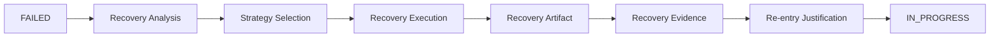

# 🔁 Recovery Strategy — Failure Response Framework

## 1. Overview

This document defines the **principles, rules, and structural strategies**
governing **Recovery** in SSDAM.

Recovery is not an ad-hoc retry mechanism,  
but a **designed response to Checkpoint FAIL**.

---

## 2. Recovery Definition

**Recovery:**

> A controlled, policy-governed response process triggered after
> a Task enters the FAILED state.

Recovery exists to:

- Address failure causes
- Preserve system determinism
- Protect Artifact integrity
- Maintain Traceability

---

## 3. Recovery Trigger

Recovery is initiated when:

Checkpoint → **FAIL**

FAIL must result in:

1. Failure recording  
2. Evidence preservation  
3. Recovery strategy selection  

---

## 4. Recovery Objectives

Recovery must aim to:

- Eliminate root cause of failure  
- Restore Task readiness  
- Preserve Traceability chain  
- Avoid non-deterministic retries  

---

## 5. Recovery Invariants

**Immutable Rules:**

- Recovery must not erase failure history  
- Recovery must not overwrite Evidence  
- Recovery must not silently re-enter READY  
- Recovery must produce Recovery Artifacts/Evidence  

---

## 6. Recovery Strategy Categories

### 6.1 Re-execution Strategy

Re-run Execution with:

- Modified Inputs  
- Corrected Preconditions  

❌ Blind retry forbidden  
✅ Structural change required

---

### 6.2 Artifact Correction Strategy

Adjust:

- Artifact structure  
- Contract violations  
- Missing components  

---

### 6.3 Evidence Completion Strategy

Used when FAIL caused by:

- Missing Evidence  
- Invalid measurements  
- Incomplete validation  

---

### 6.4 Strategy Adjustment

Modify:

- Execution approach  
- Skill selection  
- Toolchain / Method  

---

### 6.5 Scope Adjustment

Alter:

- Task boundaries  
- Constraints  
- Quality thresholds (policy-governed)  

---

### 6.6 Task Substitution

Replace Task with:

- Contract-compatible alternative  

---

## 7. Structural Change Requirement

Recovery must modify at least one:

- Input  
- Execution Strategy  
- Constraints  
- Skill Selection  
- Task Definition  

❌ Identical retry loop forbidden

---

## 8. Recovery Flow

---

## 9. Recovery Analysis

Must classify:

- Failure type  
- Root cause  
- Contract violation  
- Evidence insufficiency  
- Policy constraint breach  

---

## 10. Retry Policy

Retries allowed only when:

- Recovery strategy defined  
- Structural change introduced  

Retry limits must be policy-defined.

---

## 11. Escalation Rules

Human intervention required when:

| Condition | Action |
|----------|--------|
| Repeated identical FAIL | Human diagnosis |
| Recovery strategies exhausted | Human redesign |
| High-risk failure | Human checkpoint |
| Conflicting Evidence | Human arbitration |

---

## 12. Artifact Preservation Rules

Recovery must:

- Preserve prior Artifact  
- Preserve prior Evidence  
- Record Recovery Artifacts separately  

---

## 13. Traceability Requirements

Recovery must link:

FAIL → Recovery Strategy → Recovery Execution → Evidence → Re-entry

---

## 14. Anti-Patterns

❌ Blind retries  
❌ Failure concealment  
❌ Evidence deletion  
❌ Overwriting Artifact history  
❌ Infinite retry loops  
❌ Recovery without root-cause analysis  

---

## ✅ Key Summary

Recovery Strategy ensures:

- Failures are controlled events  
- System determinism preserved  
- Evidence integrity protected  
- Structural corrections enforced  

Recovery = **Designed system behavior**,  
not error handling patch.
