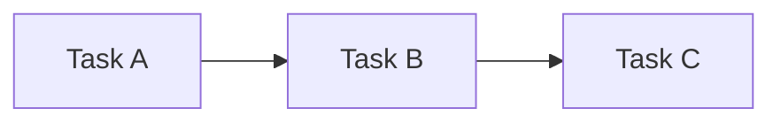
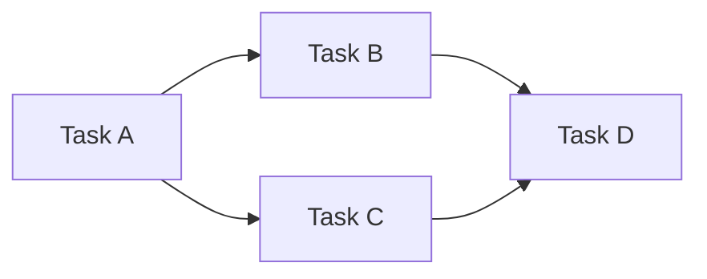
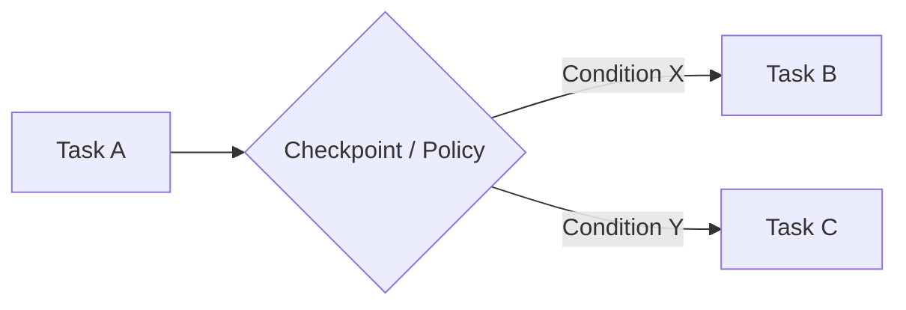
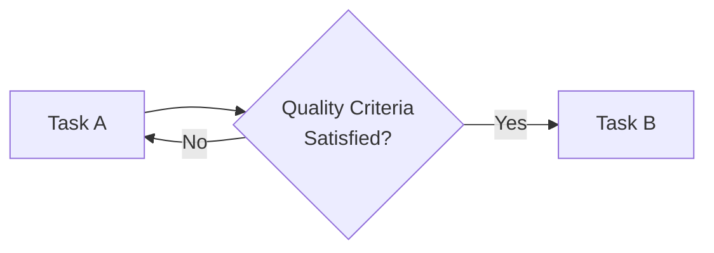
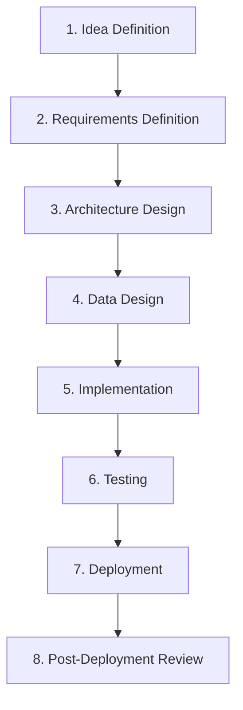

# 🧩 Task Composition — Task Composition Patterns

## 1. Overview

This document defines how independently designed **Tasks** in SSDAM  
are **connected and composed to form an end-to-end execution flow**.

It concretizes SSDAM’s design goal of a  
**Composable Task Architecture**.

---

## 2. Preconditions for Composition

For a Task to be composable, it must satisfy:

| Condition | Description |
|----------|-------------|
| Single Purpose | Internal logic focuses on one clear objective |
| Explicit Contract | Inputs / Outputs clearly defined |
| Independence | No dependency on another Task’s internal implementation |
| Substitutability | Replaceable by another Task fulfilling the same Contract |

---

## 3. Composition Patterns

### 3.1 Sequential Composition

The most fundamental pattern.  
The output of a preceding Task becomes the input of the next Task.

**Connection Rules:**

- Output Contract of Task A = Input Contract of Task B  
- Task A must reach **PASS** before Task B enters  
- Skipping intermediate Tasks is prohibited  

**Example:**

Requirement Definition  
→ Architecture Design  
→ Data Design  
→ Implementation  
→ Testing  

---

### 3.2 Parallel Composition

Independent Tasks execute concurrently.  
All parallel Tasks must reach **PASS** before the merge Task enters.

**Connection Rules:**

- No Contract conflicts between parallel Tasks  
- Parallel Tasks must not depend on each other’s Artifacts  
- Merge Task waits for all preceding **PASS** states  

**Example:**

After Architecture PASS:

├─ Backend Implementation (parallel)  
└─ Frontend Implementation (parallel)  
  └─ Integration Testing (merge)  

---

### 3.3 Conditional Composition

Branching occurs based on Checkpoint results  
or Artifact properties.

**Connection Rules:**

- Branching conditions defined explicitly  
- Branch Contracts must match upstream Output Contract  
- Implicit branching prohibited  

**Example:**

After Testing PASS:

├─ PASS + High-Risk Flag → Security Audit Task  
└─ PASS + Normal → Deployment Task  

---

### 3.4 Iterative Composition

A Task repeats by design until a condition is satisfied.

This differs from Recovery:

- **Iterative Composition** = Designed repetition  
- **Recovery** = Failure-driven correction  

**Connection Rules:**

- Maximum iteration count defined  
- Evidence accumulates  
- Escalation required when exceeded  

**Example:**

Prototype Validation (max 3 iterations)  
→ Quality Criteria PASS  
→ Main Implementation  

---

## 4. Task Substitution

Tasks fulfilling the same Contract  
must be interchangeable.

### 4.1 Substitution Conditions

| Condition | Description |
|----------|-------------|
| Compatible Input Contract | Accepts same or broader inputs |
| Compatible Output Contract | Produces same or narrower outputs |
| Artifact Compatibility | Meets downstream expectations |
| Evaluation Compatibility | Same criteria applicable |

### 4.2 Example

Original Task:

Data Design (Manual ERD)

Input: Requirement Document  
Output: schema.mmd  

Substitute Task:

Data Design (AI-Assisted ERD)

Input: Requirement Document  
Output: schema.mmd  

Internal Execution differences  
do not affect composition validity.

---

## 5. Contract Design Principles

Contracts must be defined at **minimal necessary granularity**.

### 5.1 Rules

- Do not mix unrelated concerns  
- Do not force unused outputs  
- Include only required inputs  

### 5.2 Good Example

Task: Backend Slice  

Input Contract:
- schema.mmd  
- api-spec.yaml  

Output Contract:
- compiled-code  
- test-report.json  

---

### 5.3 Bad Example

Task: Backend Slice  

Input Contract:
- project-bundle.zip  
  (requirements + design + configs + notes)

Bundling prevents validation  
and obscures dependencies.

---

## 6. Practical Composition Example

---

## 7. Composition Invariants

- No connection without Contracts  
- No dependency on internal implementations  
- No implicit branching / merging  
- No circular composition without exit criteria  
- No uncontrolled Artifact sharing  

---

## 8. Anti-Patterns

❌ Monolithic Task  
❌ Implicit Dependency  
❌ Undefined Branching  
❌ Infinite Iteration  
❌ Bundled Contracts  

---

## ✅ Key Summary

Task Composition is:

> **Not listing steps,  
> but architecting independent execution units via Contracts.**

SSDAM composability depends on:

- Contract clarity  
- Deterministic transitions  
- Structural support for substitution  
- Explicit branching & merging  

It is a core architectural property —  
not merely workflow arrangement.
