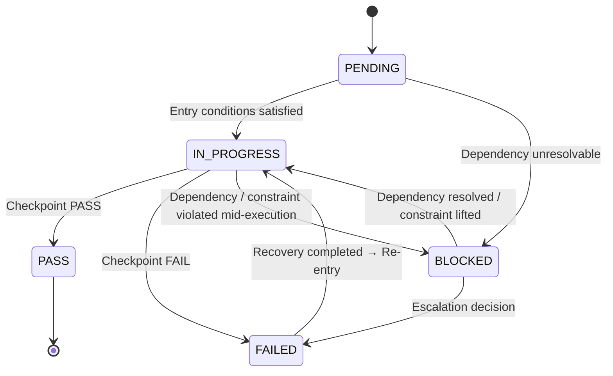

# 🔄 Task Lifecycle — Task State Machine

## 1. Overview

This document defines the **States**, **Transitions**, and **Guards**
of an SSDAM Task.

A Task is not a simple workflow step,
but operates as a **verification-driven state transition model**.

---

## 2. State Definitions

| State | Description |
|-------|-------------|
| **PENDING** | Waiting to start; preconditions not yet satisfied |
| **IN_PROGRESS** | Execution in progress (Execution → Artifact → Evaluation → Evidence) |
| **BLOCKED** | Suspended due to unresolved dependency or constraint |
| **PASS** | Terminated via Checkpoint PASS |
| **FAILED** | Terminated via Checkpoint FAIL |

---

## 3. State Transition Diagram

---

## 4. Transition Conditions (Guards)

### 4.1 PENDING → IN_PROGRESS

Entry Conditions:

- Prior Task PASS (except the first Task)
- Input Artifact exists
- Input Contract satisfied
- Required resources secured

If violated:

→ Entry denied, remain in PENDING

---

### 4.2 PENDING / IN_PROGRESS → BLOCKED

Trigger Conditions (one or more):

- Required upstream Task still FAILED or BLOCKED
- Required Artifact unavailable
- Policy gate unresolved
- External dependency failure

Actions upon BLOCKED:

1. Record blocking reason
2. Preserve current state
3. Notify owner / trigger escalation if threshold exceeded

---

### 4.3 BLOCKED → IN_PROGRESS

Unblock Conditions:

- All blocking dependencies resolved
- Required Artifacts available
- Policy gates cleared

---

### 4.4 IN_PROGRESS → PASS

Transition Conditions (ALL required):

- Artifact creation completed
- Evaluation completed
- Evidence secured
- Checkpoint PASS decision

---

### 4.5 IN_PROGRESS → FAILED

Transition Conditions (one or more):

- Evaluation criteria not met
- Artifact Contract violation
- Missing mandatory Evidence
- Quality threshold not met
- Risk level exceeds tolerance

Mandatory actions upon FAIL:

1. Record failure reason
2. Preserve Evidence
3. Select Recovery strategy

---

### 4.6 FAILED → IN_PROGRESS (Recovery Re-entry)

Re-entry Conditions:

- Failure cause classified
- Recovery strategy selected & executed
- Recovery Artifact created
- Recovery Evidence recorded
- Re-entry justification secured

If denied:

→ Remain in FAILED → Escalation

---

## 5. Escalation Rules

Human intervention becomes mandatory when:

| Condition | Action |
|----------|--------|
| Repeated identical Failure (≥ N times) | Request Human judgment |
| Uncertainty exceeds threshold | Promote to Human Checkpoint |
| Conflicting Evidence | Human arbitration |
| Recovery strategies exhausted | Human redesign decision |
| BLOCKED duration exceeds threshold | Human resolution |

Default **N** is defined by Project Policy.

---

## 6. State Invariants

- No direct PENDING → PASS
- No direct PENDING → FAILED
- No termination without IN_PROGRESS
- No reverse PASS → FAILED
- No missing Transition records
- BLOCKED must record blocking cause

---

## 7. Traceability Requirements

All state transitions must record:

| Item | Description |
|------|-------------|
| Transition Time | Timestamp |
| Previous State | FROM |
| Next State | TO |
| Transition Basis | Checkpoint / Recovery / Dependency |
| Actor | Human / Agent / Policy |

---

## 8. Anti-Patterns

❌ Implicit transitions (no record)
❌ Guard-skipping transitions
❌ Infinite Recovery loops
❌ State skipping (PENDING → PASS shortcut)
❌ BLOCKED without recorded cause

---

## ✅ Key Summary

The Task State Machine is:

> **Not a flow control mechanism,
> but a deterministic rule set for verification-driven state transitions.**

In SSDAM, Task progression is allowed only by:

- Activity completion ❌
- Time passage ❌
- **Verified condition satisfaction ✅**
