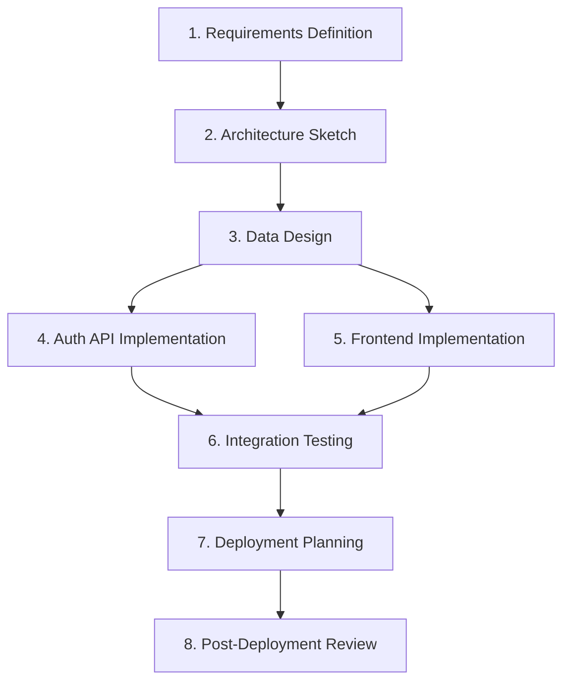

# 📋 Mission Planning Guide

## 1. Overview

This document defines the **procedure for decomposing Mission objectives into SSDAM Tasks**
and constructing the **overall execution flow**.

Individual Task design should follow:

`04_methodology/task-design-guide.md`

This guide focuses on:

- Inter-task relationships  
- Dependency structure  
- Composition design  
- Mission-level policies  

---

## Planning Procedure

```
Goal Decomposition → Task Identification → Dependency Analysis → Composition Design → Policy Definition → Plan Validation
```

---

## 2. Step 1 — Goal Decomposition

Decompose the final Mission objective into **independently verifiable sub-goals**.

### 2.1 Decomposition Criteria

| Criterion | Key Question |
|----------|--------------|
| Verifiability | Can this goal be evaluated objectively? |
| Independence | Can this goal be validated independently? |
| Artifact Presence | Can the outcome be expressed as an Artifact? |

---

### 2.2 Decomposition Procedure

1. Describe the final objective  
2. Ask repeatedly:  
   **“What must be validated before this can succeed?”**  
3. Stop when further decomposition loses meaning  
4. Validate each sub-goal  

---

### 2.3 Example

Final Objective:  
“Deliver a web application with user authentication”

```
Deliver Web Application
├─ Requirements validated?
├─ Architecture validated?
├─ Data model validated?
├─ Auth API implemented/validated?
├─ Frontend implemented/validated?
├─ Integration tests PASS?
├─ Deployment strategy defined?
└─ Operational stability verified?
```

---

### 2.4 Anti-Patterns

❌ “Backend complete”  
❌ “Build great UX”  
✅ “Implement authentication API and PASS tests”

---

## 3. Step 2 — Task Identification

Transform sub-goals into **SSDAM Tasks**.

### 3.1 Transformation Rules

| Condition | Rule |
|----------|------|
| Single Purpose | Split if mixed concerns |
| Produces Artifact | Otherwise invalid |
| Terminates via Checkpoint | Must be definable |
| I/O Contract | Must be explicit |

---

### 3.2 Task List Example

| # | Task | Purpose | Key Artifact |
|---|------|---------|--------------|
| 1 | Requirements Definition | Structure requirements | requirements.md |
| 2 | Architecture Sketch | Define system structure | architecture.md |
| 3 | Data Design | Model entities | schema.mmd |
| 4 | Auth API Implementation | Implement auth endpoints | auth-api |
| 5 | Frontend Implementation | Build UI | frontend |
| 6 | Integration Testing | Validate system | test-report.json |
| 7 | Deployment Planning | Define deployment | deploy-plan.md |
| 8 | Post-Deployment Review | Verify stability | post-deploy-report.md |

---

### 3.3 Validation Questions

- Are all sub-goals mapped to Tasks?  
- Any missing validation units?  
- Any multi-purpose Tasks?  

---

## 4. Step 3 — Dependency Analysis

Analyze **Artifact-based dependencies**.

### 4.1 Dependency Matrix Example

| Task | Prerequisite | Required Artifact |
|------|-------------|------------------|
| Requirements Definition | — | — |
| Architecture Sketch | Requirements Definition | requirements.md |
| Data Design | Architecture Sketch | architecture.md |
| Auth API Implementation | Data Design | schema.mmd |
| Frontend Implementation | Data Design | schema.mmd |
| Integration Testing | Auth API + Frontend | auth-api, frontend |
| Deployment Planning | Integration Testing | test-report.json |
| Post-Deployment Review | Deployment Planning | deploy-plan.md |

---

### 4.2 Analysis Rules

- Dependencies must be Artifact-driven  
- Parallelization allowed only when Artifact-independent  
- Circular dependencies prohibited  

---

### 4.3 Anti-Patterns

❌ Implicit dependency  
❌ Activity-based order  
✅ Artifact-based dependency  

---

## 5. Step 4 — Composition Design

Apply Task Composition patterns:

`03_architecture/task-composition.md`

---

### 5.1 Pattern Application

| Scenario | Pattern |
|----------|---------|
| Linear dependency | Sequential |
| Independent branches | Parallel |
| Checkpoint-based branching | Conditional |
| Quality loops | Iterative |

---

### 5.2 Flow Example



---

## 6. Step 5 — Mission-Level Policy Definition

Define cross-cutting Mission policies.

### 6.1 Recovery Policy

- Max Recovery Attempts  
- Escalation Threshold  
- Rollback Scope  

---

### 6.2 Quality Policy

- Coverage Threshold  
- Security Threshold  
- Review Requirements  

---

### 6.3 Agent Policy

- Allowed Roles  
- Human-Checkpoint Tasks  
- Confidence Threshold  
- Uncertainty Escalation  

---

### 6.4 Traceability Policy

- Retention Rules  
- Evidence Storage  
- Audit Readiness  

---

## 7. Step 6 — Plan Validation

### 7.1 Checklist

**Goal Decomposition**

- [ ] Objective clearly defined  
- [ ] Sub-goals verifiable  

**Task Identification**

- [ ] Tasks single-purpose  
- [ ] Artifacts defined  

**Dependencies**

- [ ] Artifact-based  
- [ ] No circular dependency  

**Composition**

- [ ] Explicit patterns  
- [ ] Parallel independence verified  

**Policies**

- [ ] Recovery policy  
- [ ] Quality policy  
- [ ] Agent policy  
- [ ] Traceability policy  

---

## 8. Planning Template

```md
# Mission: [Name]

## Final Objective
[One sentence]

## Task List
| # | Task | Purpose | Artifact |

## Dependency Matrix
| Task | Prerequisite | Artifact |

## Flow
[Mermaid Diagram]

## Composition Summary
| Segment | Pattern |

## Mission Policies
### Recovery
### Quality
### Agent
### Traceability
```

---

## ✅ Key Summary

Mission planning is:

> **Not a task list, but a design activity connecting verifiable Tasks
> through Contracts, Dependencies, and Policies.**

A well-designed Mission plan:

- Ensures deterministic execution flow  
- Predefines validation structure  
- Controls failure & recovery paths  
