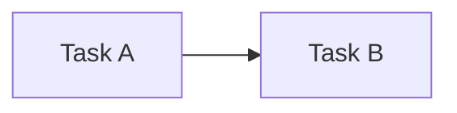

# 🔗 Dependency Model — Task 의존성 구조

## 1. 개요 (Overview)

본 문서는 SSDAM에서 **Task 간 의존성 관계(Dependency)**를 정의한다.

의존성은 다음을 결정한다:

- 실행 순서
- READY 조건
- BLOCKED 상태
- 실패 전파
- 결정적 흐름 제어

SSDAM은 의존성을  
**암묵적 가정이 아닌 명시적 구조 계약**으로 취급한다.

---

## 2. 의존성 정의 (Dependency Definition)

**Task Dependency:**

> 특정 Task가 READY 또는 IN_PROGRESS로 진입하기 위해  
> 다른 Task의 상태, Artifact, Evidence, 또는 정책 결정에 의해
> 제약되는 규칙

---

## 3. 의존성 유형 (Dependency Types)

### 3.1 Sequential Dependency (순차 의존성)

Task B는 Task A가 PASS 되어야 실행 가능.

**규칙:**

- Task A PASS 필수
- A의 Output Contract = B의 Input Contract 충족

---

### 3.2 Data Dependency (데이터 의존성)

특정 Artifact에 의존.

예시:

Task B requires:

- schema.mmd  
- api-spec.yaml  

**규칙:**

- Artifact 존재 필수
- Artifact Contract 검증

---

### 3.3 Evidence Dependency (근거 의존성)

검증된 Evidence 요구.

예시:

Deployment Task requires:

- Testing Evidence  
- Security Evidence  

---

### 3.4 Policy Dependency (정책 의존성)

정책 결정 이후 실행 허용.

예시:

Release Task requires:

- Compliance Approval  
- Risk Acceptance  

---

### 3.5 Soft Dependency (소프트 의존성)

정책에 의해 완화 가능.

예시:

성능 최적화 (선택 Task)

---

### 3.6 Hard Dependency (하드 의존성)

**절대 우회 불가**.

예시:

보안 검증 → 운영 배포 이전 필수

---

## 4. 의존성 그래프 모델

SSDAM 의존성 구조는:

> **Directed Acyclic Graph (DAG)**

특성:

- 순환 의존 금지
- 결정적 실행 순서
- 명시적 의존성 연결

---

## 5. BLOCKED 상태 진입 조건

Task는 다음 경우 BLOCKED:

- 필수 의존성 미충족
- 필수 Artifact 누락
- 정책 게이트 미해결
- 선행 Task FAILED

---

## 6. 의존성 위반 처리

위반 시:

1. BLOCKED 상태 전이
2. 위반 기록 생성
3. Evidence 캡처 (필요 시)
4. Recovery / Escalation

---

## 7. 실패 전파 규칙

| 의존성 유형 | 전파 동작 |
|------------|-----------|
| Sequential | 후속 Task BLOCKED |
| Data | 소비 Task BLOCKED |
| Evidence | 판단 게이트 무효화 |
| Policy | 실행 거부 |
| Soft | 정책 기반 |
| Hard | 강제 BLOCKED |

---

## 8. 순환 의존성 금지

❌ A → B → C → A

**이유:**

결정성 붕괴  
Deadlock 발생  
READY 판단 불가능

---

## 9. 의존성 해결 전략

예시:

- 선행 Task Recovery
- Artifact 재생성
- Task 대체(Substitution)
- Soft Dependency 완화
- Mission-Level 재설계

---

## 10. READY 조건 평가

Task READY requires:

- 모든 Hard Dependency 충족
- 필수 Artifact 존재
- 필수 Evidence 검증
- Policy Gate 해결

---

## 11. 안티패턴 (Anti-Patterns)

❌ 암묵적 의존성  
❌ 숨겨진 Artifact 결합  
❌ 순환 의존성  
❌ Soft / Hard 모호성  
❌ Contract 없는 Dependency  

---

## ✅ 핵심 요약 (Key Summary)

SSDAM Dependency Model은 보장한다:

- 결정적 실행 순서
- 명시적 READY 규칙
- 통제된 BLOCKED 상태
- 예측 가능한 실패 전파

의존성은:

> **워크플로 주석이 아니라  
> 핵심 아키텍처 요소이다.**
