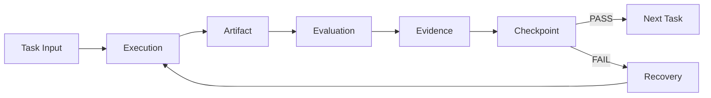
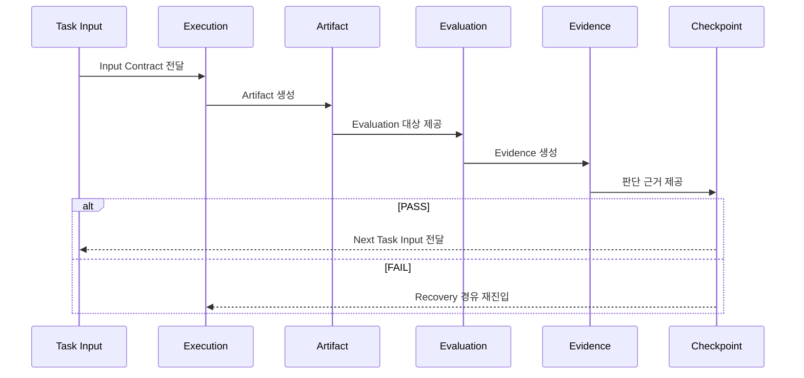

# ⚙️ Flow Architecture — Task 내부 흐름 구조

## 1. 개요 (Overview)

본 문서는 단일 **Task 내부에서** 다음 흐름이 어떻게 연결되고,

**Execution → Artifact → Evaluation → Evidence → Checkpoint**

각 요소 간 데이터가 어떤 계약 관계로 전달되는지 정의한다.

세부 요소 정의는 `05_references/` 문서를 참조한다.
본 문서는 **요소 간 연결 구조 및 Contract 관계**에 초점을 둔다.

---

## 2. 전체 흐름 (Overall Flow)

---

## 3. 요소 간 Input / Output 계약

### 3.1 Task Input → Execution

| 항목 | 설명 |
|------|------|
| Input | 선행 Artifact, Evidence, Requirement, Policy, Constraint |
| Contract | 입력 형식 정의, 버전 식별 가능, 참조 가능 |
| 위반 시 | Execution 진입 거부 |

---

### 3.2 Execution → Artifact

| 항목 | 설명 |
|------|------|
| Input | Task Input + Execution 활동 |
| Output | 검증 가능한 Artifact |
| Contract | 구조 명시, Contract 준수, Evaluation 가능 |
| 위반 시 | Artifact 무효 → Evaluation 거부 |

**핵심 원칙:**

- Execution의 목적은 Artifact 생성  
- Execution 단계에서 PASS / FAIL 판단 금지  

---

### 3.3 Artifact → Evaluation

| 항목 | 설명 |
|------|------|
| Input | Artifact + Evaluation 기준 + Policy + Quality Threshold |
| Output | Evaluation 결과 (PASS / FAIL), 리포트, 메트릭 |
| Contract | Artifact는 평가 가능 상태여야 함 |
| 위반 시 | Evaluation 진행 불가 |

**Evaluation 유형:**

- Contract Evaluation  
- Quality Evaluation  
- Policy Evaluation  
- Human Evaluation  
- Agent Evaluation  

---

### 3.4 Evaluation → Evidence

| 항목 | 설명 |
|------|------|
| Input | Evaluation 결과 |
| Output | 객관적·재현 가능한 Evidence |
| Contract | Evaluation과 1:1 매핑, 출처·Timestamp 포함 |
| 위반 시 | Evidence 없는 Evaluation → 무효 |

**Evidence Lifecycle:**

Generated → Recorded → Frozen → Referenced → Audited

Frozen 이후 임의 수정 금지.

---

### 3.5 Evidence → Checkpoint

| 항목 | 설명 |
|------|------|
| Input | Artifact + Evaluation 결과 + Evidence |
| Output | PASS / FAIL 결정 + 상태 전이 |
| Contract | 정책 기반 판단 + Evidence 근거 필수 |
| 위반 시 | Checkpoint 무효 → SSDAM 위반 |

**Checkpoint 판단 규칙:**

- Artifact 존재만으로 판단 ❌  
- 활동 완료만으로 판단 ❌  
- Evidence 충족 기반 판단 ✅  

---

### 3.6 Checkpoint → 분기 (Branching)

**PASS 경로:**

Checkpoint PASS  
→ Task State = PASS  
→ Next Task READY

전달 항목:

- 검증된 Artifact  
- Evidence  
- Decision Record  

---

**FAIL 경로:**

Checkpoint FAIL  
→ Task State = FAILED  
→ Recovery 진입

전달 항목:

- 실패 사유  
- 보존된 Evidence  
- 기존 Artifact (변경 없음)

---

### 3.7 Recovery → Execution (재진입)

| 항목 | 설명 |
|------|------|
| Input | Failure 분류, Recovery 전략, 기존 Artifact/Evidence |
| Output | 수정/재생성 Artifact, Recovery Evidence |
| Contract | 실패 원인 분류, 전략 정당화, 이력 보존 |
| 위반 시 | 재진입 거부 |

Recovery는 이전 흐름을 덮어쓰지 않는다.  
기존 FAIL 이력과 Evidence는 유지된다.

---

## 4. 시퀀스 다이어그램

---

## 5. 데이터 흐름 요약

Task Input  
→ Execution  
→ Artifact  
→ Evaluation  
→ Evidence  
→ Checkpoint  

Checkpoint → PASS / FAIL → Next Task / Recovery

---

## 6. 불변 규칙 (Invariant Rules)

- 요소 순서 변경 금지  
  (Execution → Artifact → Evaluation → Evidence → Checkpoint)

- 요소 생략 금지  

- 역방향 데이터 흐름 금지  

- 재진입은 Recovery 경유만 허용  

---

## 7. 안티패턴 (Anti-Patterns)

❌ Execution → 직접 Checkpoint  
❌ Artifact 없는 Evaluation  
❌ Evidence 없는 Checkpoint  
❌ FAIL → Next Task 진행  
❌ Checkpoint 이후 Artifact 수정

---

## ✅ 핵심 요약

Task 내부 흐름은:

> **단순 절차가 아니라,  
> Contract로 연결된 검증 중심 파이프라인이다.**

각 요소의 Output은  
다음 요소의 Contract를 충족해야 하며,

Task 진행은 오직:

- 활동 완료 ❌  
- 시간 경과 ❌  
- **검증된 조건 충족 ✅**
