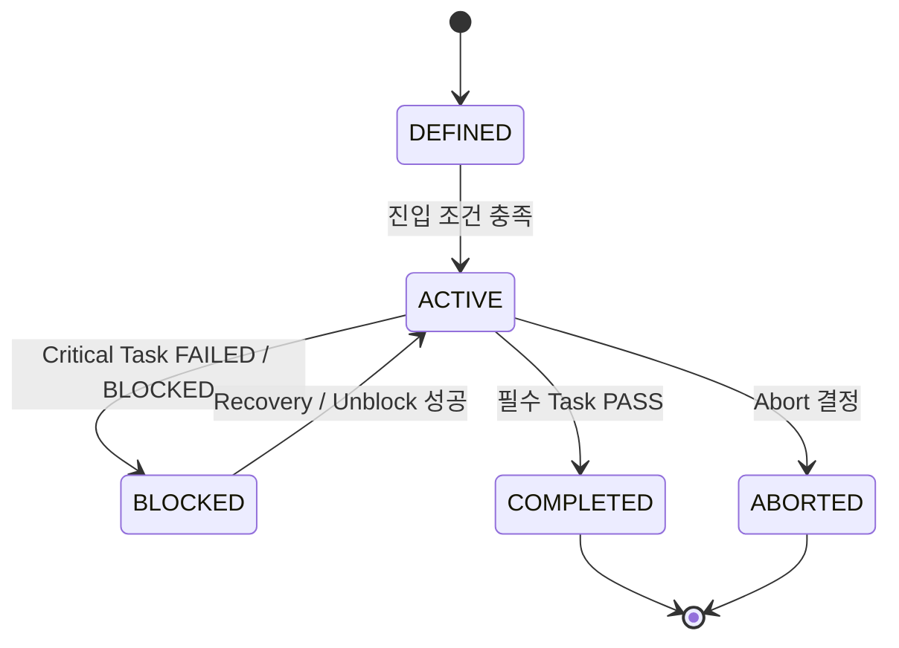

# 🚀 Mission Architecture — Mission 구조 & 거버넌스

## 1. 개요 (Overview)

본 문서는 SSDAM에서 **Mission의 구조적 역할, 생명주기, 거버넌스 규칙**을 정의한다.

Mission은 실행 단위가 아니라 **의도(Intent) 단위**이다.

- Task → 실행 및 상태 전이 담당  
- Mission → 방향, 조합, 완료 경계 정의  

---

## 2. Mission 정의 (Mission Definition)

**Mission:**

> 여러 Task로 구성된 상위 의도 컨테이너

Mission은:

- 직접 실행되지 않음  
- Execution을 수행하지 않음  
- Task 조합 및 진행 구조를 정의  

---

## 3. Mission vs Task

| 요소 | 역할 |
|------|------|
| **Mission** | 의도 / 오케스트레이션 단위 |
| **Task** | 실행 / 검증 단위 |

**핵심 규칙:**

- Mission은 구조를 정의  
- Task는 실행을 수행  
- 상태 전이는 **Task 레벨에서만 발생**  

---

## 4. Mission 책임 (Responsibilities)

Mission은 다음을 정의한다:

- Intent / Objective  
- Task 조합 구조  
- 진입 조건  
- 완료 기준  
- Escalation 경계  
- 리스크 허용 범위  

---

## 5. Mission 생명주기 (Lifecycle)

| 상태 | 설명 |
|------|------|
| **DEFINED** | Mission 정의 및 Task 구조 선언 |
| **ACTIVE** | 하나 이상의 Task IN_PROGRESS |
| **BLOCKED** | Task 실패 / 의존성 문제로 중단 |
| **COMPLETED** | 모든 필수 Task PASS |
| **ABORTED** | 정책 / Human 결정으로 종료 |

---

## 6. Mission 상태 전이

---

## 7. 진입 조건 (Entry Conditions)

Mission은 다음 조건에서 ACTIVE 진입 가능:

- Mission 정의 검증 완료  
- 초기 Task READY  
- Constraints 충족  
- 리소스 확보  

위반 시 → DEFINED 유지

---

## 8. 완료 기준 (Completion Criteria)

Mission COMPLETED 조건:

- 모든 필수 Task PASS  
- 요구 Artifact 생성  
- Evidence 기록 완료  
- Completion 정책 충족  

---

## 9. 부분 완료 정책 (Partial Completion Policy)

Mission은 다음 유형 정의 가능:

- Mandatory Tasks  
- Optional Tasks  
- Conditional Tasks  

---

## 10. Task Failure의 Mission 영향

| Task 상태 | Mission 영향 |
|-----------|--------------|
| FAILED | BLOCKED 또는 ACTIVE (정책 기반) |
| BLOCKED | Mission BLOCKED |
| PASS | 진행 지속 |

---

## 11. Mission-Level Recovery

Trigger:

- 구조 붕괴  
- 반복 Failure 허용치 초과  
- 전략 무효화  

예시:

- Task 재배치  
- Task 대체  
- Scope 조정  
- Mission 재정의 / 중단  

---

## 12. 거버넌스 불변 규칙 (Immutable Rules)

- Mission은 실행하지 않는다  
- Mission은 Artifact를 직접 생성하지 않는다  
- PASS / FAIL은 Task만 가진다  
- Mission은 완료 경계를 정의한다  

---

## 13. Escalation 권위

Human 개입 필수 조건:

- Mission 리스크 임계치 초과  
- Recovery 전략 고갈  
- Task 간 Evidence 충돌  

---

## 14. Traceability 요구사항

Mission  
→ Tasks  
→ Artifacts  
→ Evidence  
→ Decisions  

고아 Task 금지.

---

## 15. 안티패턴 (Anti-Patterns)

❌ 실행 가능한 Mission  
❌ Task 구조 없는 Mission  
❌ 암묵적 완료 기준  
❌ Mission PASS / FAIL 오용  

---

## ✅ 핵심 요약 (Key Summary)

Mission Architecture는:

> **의도 구조, 오케스트레이션 경계,
> Task 실행 거버넌스 규칙을 정의한다.**

SSDAM에서:

- Mission = Why / Direction  
- Task = How / Execution  
- Checkpoint = Validation Authority  
