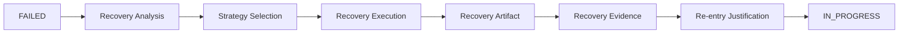

# 🔁 Recovery Strategy — 실패 대응 프레임워크

## 1. 개요 (Overview)

본 문서는 SSDAM에서 **Recovery의 원칙, 규칙, 구조적 전략**을 정의한다.

Recovery는 단순 재시도가 아니라,

> **Checkpoint FAIL 이후 트리거되는 설계된 시스템 동작**

이다.

---

## 2. Recovery 정의 (Definition)

**Recovery:**

> Task가 FAILED 상태로 전이된 이후 수행되는  
> 통제되고 정책 기반의 대응 프로세스

Recovery 목적:

- 실패 원인 해결  
- 시스템 결정성 유지  
- Artifact 무결성 보호  
- Traceability 보존  

---

## 3. Recovery 트리거

Checkpoint → **FAIL**

FAIL 발생 시 필수 조치:

1. Failure 기록  
2. Evidence 보존  
3. Recovery 전략 선택  

---

## 4. Recovery 목표

Recovery는 반드시 다음을 지향:

- 실패의 근본 원인 제거  
- Task READY 조건 복구  
- Traceability 체인 유지  
- 비결정적 재시도 방지  

---

## 5. Recovery 불변 규칙 (Invariants)

**불변 규칙:**

- 실패 이력 삭제 금지  
- 기존 Evidence 삭제/덮어쓰기 금지  
- 암묵적 READY 재진입 금지  
- Recovery Artifact/Evidence 생성 필수  

---

## 6. Recovery 전략 유형

### 6.1 Re-execution Strategy

조건:

- Input 수정  
- 사전 조건 보정  

❌ 동일 조건 재시도 금지  
✅ 구조적 변경 필수

---

### 6.2 Artifact Correction Strategy

수정 대상:

- Artifact 구조  
- Contract 위반  
- 누락 요소  

---

### 6.3 Evidence Completion Strategy

FAIL 원인:

- Evidence 누락  
- 측정 무효  
- Validation 불완전  

---

### 6.4 Strategy Adjustment

변경:

- Execution 방식  
- Skill 선택  
- Toolchain / 접근법  

---

### 6.5 Scope Adjustment

조정:

- Task 범위  
- Constraints  
- Quality Threshold (정책 기반)  

---

### 6.6 Task Substitution

대체:

- Contract 호환 Task  

---

## 7. 구조적 변경 요구사항

Recovery는 최소 하나 변경:

- Input  
- Execution Strategy  
- Constraints  
- Skill Selection  
- Task Definition  

❌ 동일 재시도 루프 금지

---

## 8. Recovery 흐름

---

## 9. Recovery 분석

필수 분류:

- Failure 유형  
- Root Cause  
- Contract 위반  
- Evidence 부족  
- Policy 제약 위반  

---

## 10. Retry 정책

Retry 허용 조건:

- Recovery 전략 정의  
- 구조적 변경 적용  

Retry 제한 횟수는 정책 정의 필수.

---

## 11. Escalation 규칙

Human 개입 필수 조건:

| 조건 | 조치 |
|------|------|
| 동일 FAIL 반복 | Human 분석 |
| 전략 고갈 | Human 재설계 |
| 고위험 실패 | Human Checkpoint |
| Evidence 충돌 | Human 중재 |

---

## 12. Artifact 보존 규칙

Recovery는:

- 기존 Artifact 보존  
- 기존 Evidence 보존  
- Recovery Artifact 분리 기록  

---

## 13. Traceability 요구사항

FAIL  
→ Recovery Strategy  
→ Recovery Execution  
→ Evidence  
→ 재진입 정당성  

---

## 14. 안티패턴 (Anti-Patterns)

❌ Blind Retry  
❌ Failure 은폐  
❌ Evidence 삭제  
❌ Artifact 이력 덮어쓰기  
❌ 무한 재시도  
❌ Root Cause 없는 Recovery  

---

## ✅ 핵심 요약 (Key Summary)

Recovery Strategy는 보장한다:

- 실패는 통제 가능한 이벤트  
- 시스템 결정성 유지  
- Evidence 무결성 보호  
- 구조적 수정 강제  

Recovery는:

> **에러 처리 패치가 아니라  
> 설계된 시스템 동작이다.**
