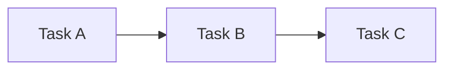
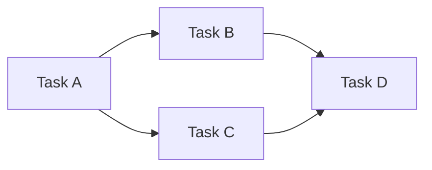
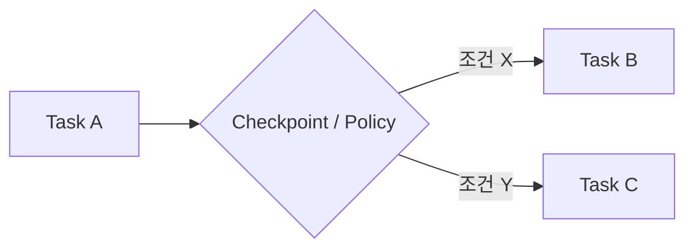
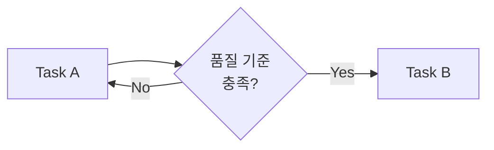
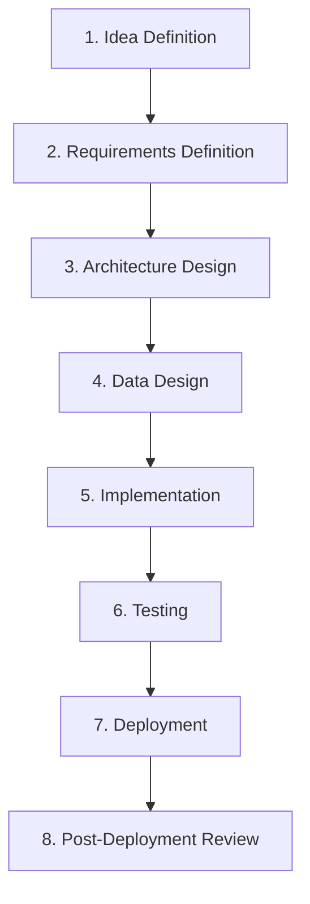

# 🧩 Task Composition — Task 조합 패턴

## 1. 개요 (Overview)

본 문서는 SSDAM에서 독립적으로 설계된 **Task들이**  
어떻게 연결되고 조합되어 **End-to-End 실행 흐름**을 구성하는지 정의한다.

이는 SSDAM의 핵심 설계 목표인  
**Composable Task Architecture**를 구체화한다.

---

## 2. 조합 가능 조건 (Preconditions for Composition)

Task가 조합 가능하려면 다음 조건을 충족해야 한다:

| 조건 | 설명 |
|------|------|
| Single Purpose | 내부 로직이 하나의 명확한 목적에 집중 |
| Explicit Contract | Input / Output 계약이 명시됨 |
| Independence | 다른 Task의 내부 구현에 의존하지 않음 |
| Substitutability | 동일 Contract를 만족하는 Task로 대체 가능 |

---

## 3. Task 조합 패턴 (Composition Patterns)

### 3.1 Sequential Composition (순차 조합)

가장 기본적인 패턴.  
선행 Task의 Output이 다음 Task의 Input이 된다.

**연결 규칙:**

- Task A의 Output Contract = Task B의 Input Contract  
- Task A는 반드시 **PASS 상태** 도달 후 Task B 진입  
- 중간 Task 생략 금지  

**예시:**

요구사항 정의  
→ 아키텍처 설계  
→ 데이터 설계  
→ 구현  
→ 테스트  

---

### 3.2 Parallel Composition (병렬 조합)

독립적인 Task들이 동시에 실행된다.  
후속 Task는 모든 선행 Task가 PASS 되어야 진입 가능.

**연결 규칙:**

- 병렬 Task 간 Contract 충돌 금지  
- 서로의 Artifact에 직접 의존 금지  
- Merge Task는 모든 PASS 상태 대기  

**예시:**

Architecture PASS 이후:

├─ Backend 구현 (병렬)  
└─ Frontend 구현 (병렬)  
  └─ 통합 테스트 (Merge)

---

### 3.3 Conditional Composition (조건부 조합)

Checkpoint 결과 또는 Artifact 속성에 따라 분기.

**연결 규칙:**

- 분기 조건은 명시적으로 정의  
- 각 분기의 Contract는 상위 Output과 호환  
- 암묵적 분기 금지  

**예시:**

Testing PASS 이후:

├─ PASS + High-Risk → Security Audit  
└─ PASS + Normal → Deployment  

---

### 3.4 Iterative Composition (반복 조합)

특정 조건 충족 시까지 Task를 의도적으로 반복.

Recovery와 구분:

- Iteration = 설계된 반복  
- Recovery = 실패 기반 대응  

**연결 규칙:**

- 최대 반복 횟수 정의  
- Evidence 누적  
- 초과 시 Escalation 필수  

**예시:**

Prototype 검증 (최대 3회 반복)  
→ 품질 기준 PASS  
→ 본 구현 Task  

---

## 4. Task Substitution (Task 대체)

동일 Contract를 만족하는 Task는  
상호 대체 가능해야 한다.

### 4.1 대체 조건

| 조건 | 설명 |
|------|------|
| Input Contract 호환 | 동일 또는 더 넓은 입력 허용 |
| Output Contract 호환 | 동일 또는 더 좁은 출력 제공 |
| Artifact 호환성 | 후속 Task 요구 충족 |
| Evaluation 호환성 | 동일 기준 적용 가능 |

### 4.2 예시

Original Task:

Data Design (Manual ERD)

Input: Requirement Document  
Output: schema.mmd  

Substitute Task:

Data Design (AI-Assisted ERD)

Input: Requirement Document  
Output: schema.mmd  

내부 Execution 차이는  
조합 구조에 영향 없음.

---

## 5. Contract 설계 원칙

Contract는 **최소 필요 단위로 분리**되어야 한다.

### 5.1 규칙

- 서로 다른 관심사 혼합 금지  
- 사용되지 않는 Output 강제 금지  
- 필수 Input만 포함  

---

### 5.2 좋은 예시

Task: Backend Slice

Input Contract:
- schema.mmd  
- api-spec.yaml  

Output Contract:
- compiled-code  
- test-report.json  

---

### 5.3 나쁜 예시

Task: Backend Slice

Input Contract:
- project-bundle.zip  
  (요구사항 + 설계 + 설정 + 회의록)

번들링은 검증 불가능성과  
의존성 불투명성을 초래한다.

---

## 6. 실전 조합 예시

---

## 7. 조합 불변 규칙 (Composition Invariants)

- Contract 없는 연결 금지  
- 내부 구현 의존 연결 금지  
- 암묵적 분기 / 병합 금지  
- 종료 조건 없는 순환 조합 금지  
- 통제되지 않은 Artifact 공유 금지  

---

## 8. 안티패턴 (Anti-Patterns)

❌ Monolithic Task  
❌ Implicit Dependency  
❌ Undefined Branching  
❌ Infinite Iteration  
❌ Bundled Contracts  

---

## ✅ 핵심 요약

Task Composition은:

> **단계 나열이 아니라,  
> Contract 기반 독립 실행 단위의 구조적 설계이다.**

SSDAM의 조합 가능성은 다음에 의존한다:

- Contract 명확성  
- 결정적 상태 전이  
- 대체 가능 구조  
- 명시적 분기 / 병합  

이는 단순 워크플로가 아니라  
**핵심 아키텍처 속성**이다.
