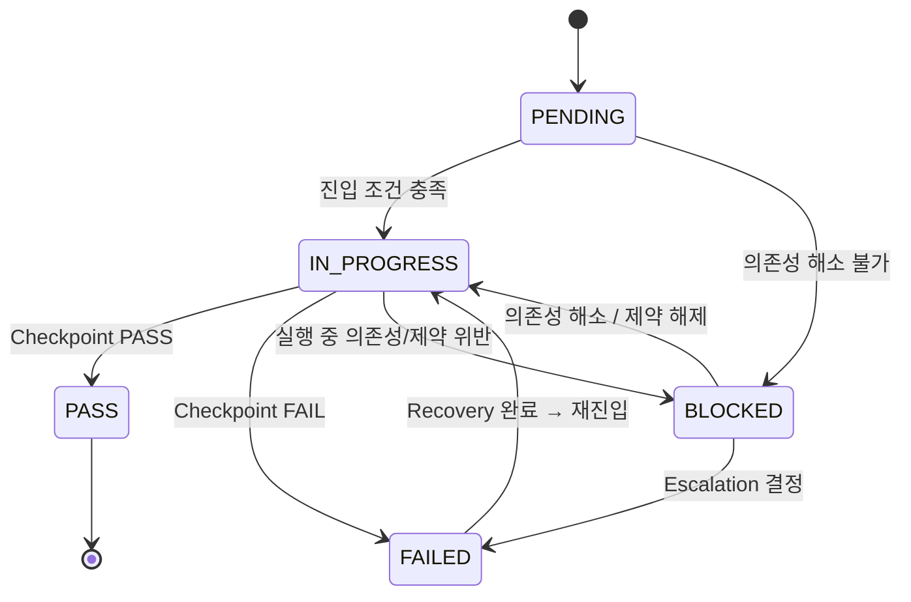

# 🔄 Task Lifecycle — Task 상태 머신

## 1. 개요 (Overview)

본 문서는 SSDAM Task의 **상태(State)**, **전이(Transition)**,
그리고 **가드 조건(Guards)**을 정의한다.

Task는 단순한 워크플로 단계가 아니라,
**검증 중심 상태 전이 모델**로 동작한다.

---

## 2. 상태 정의 (State Definitions)

| 상태 | 설명 |
|------|------|
| **PENDING** | 시작 대기 중; 사전 조건 미충족 |
| **IN_PROGRESS** | 실행 진행 중 (Execution → Artifact → Evaluation → Evidence) |
| **BLOCKED** | 미해소 의존성 또는 제약으로 인해 일시 중단 |
| **PASS** | Checkpoint PASS로 종료 |
| **FAILED** | Checkpoint FAIL로 종료 |

---

## 3. 상태 전이 다이어그램

---

## 4. 전이 조건 (Guards)

### 4.1 PENDING → IN_PROGRESS

진입 조건:

- 선행 Task PASS (첫 Task 제외)
- Input Artifact 존재
- Input Contract 충족
- 필수 리소스 확보

조건 위반 시:

→ PENDING 상태 유지 (진입 거부)

---

### 4.2 PENDING / IN_PROGRESS → BLOCKED

발생 조건 (하나 이상):

- 선행 Task가 여전히 FAILED 또는 BLOCKED 상태
- 필수 Artifact 미확보
- 정책 게이트 미해소
- 외부 의존성 실패

BLOCKED 진입 시 필수 조치:

1. 차단 사유 기록
2. 현재 상태 보존
3. 담당자 통보 / 임계치 초과 시 Escalation 트리거

---

### 4.3 BLOCKED → IN_PROGRESS

해제 조건:

- 모든 차단 의존성 해소
- 필수 Artifact 확보
- 정책 게이트 통과

---

### 4.4 IN_PROGRESS → PASS

전이 조건 (모두 충족):

- Artifact 생성 완료
- Evaluation 완료
- Evidence 확보
- Checkpoint PASS 결정

---

### 4.5 IN_PROGRESS → FAILED

전이 조건 (하나 이상):

- Evaluation 기준 미충족
- Artifact Contract 위반
- 필수 Evidence 누락
- 품질 기준 미달
- 허용 리스크 초과

FAIL 시 필수 조치:

1. 실패 사유 기록
2. Evidence 보존
3. Recovery 전략 선택

---

### 4.6 FAILED → IN_PROGRESS (Recovery 재진입)

재진입 조건:

- 실패 원인 분류 완료
- Recovery 전략 선택 및 실행
- Recovery Artifact 생성
- Recovery Evidence 기록
- 재진입 정당성 확보

거부 시:

→ FAILED 유지 → Escalation

---

## 5. Escalation 규칙

다음 조건 발생 시 Human 개입 필수:

| 조건 | 조치 |
|------|------|
| 동일 Failure 반복 (≥ N회) | Human 판단 요청 |
| Uncertainty 임계치 초과 | Human Checkpoint 승격 |
| Evidence 충돌 | Human 중재 |
| Recovery 전략 고갈 | Human 재설계 결정 |
| BLOCKED 지속 시간 임계 초과 | Human 해소 |

기본값 **N**은 프로젝트 정책에 의해 정의된다.

---

## 6. 상태 불변 규칙 (State Invariants)

- PENDING → PASS 직접 전이 금지
- PENDING → FAILED 직접 전이 금지
- IN_PROGRESS 없이 종료 금지
- PASS → FAILED 역전이 금지
- 전이 기록 누락 금지
- BLOCKED 진입 시 차단 사유 반드시 기록

---

## 7. Traceability 요구사항

모든 상태 전이는 다음을 기록해야 한다:

| 항목 | 설명 |
|------|------|
| Transition Time | 타임스탬프 |
| Previous State | FROM |
| Next State | TO |
| Transition Basis | Checkpoint / Recovery / 의존성 |
| Actor | Human / Agent / Policy |

---

## 8. 안티패턴 (Anti-Patterns)

❌ 기록 없는 암묵적 전이
❌ Guard 무시 전이
❌ 무한 Recovery 루프
❌ 상태 스킵 (PENDING → PASS 단축)
❌ 사유 없는 BLOCKED 진입

---

## ✅ 핵심 요약

Task 상태 머신은:

> **흐름 제어 메커니즘이 아니라,
> 검증 중심 상태 전이를 위한 결정적 규칙 집합이다.**

SSDAM에서 Task 진행은:

- 활동 완료 ❌
- 시간 경과 ❌
- **검증된 조건 충족 ✅**
