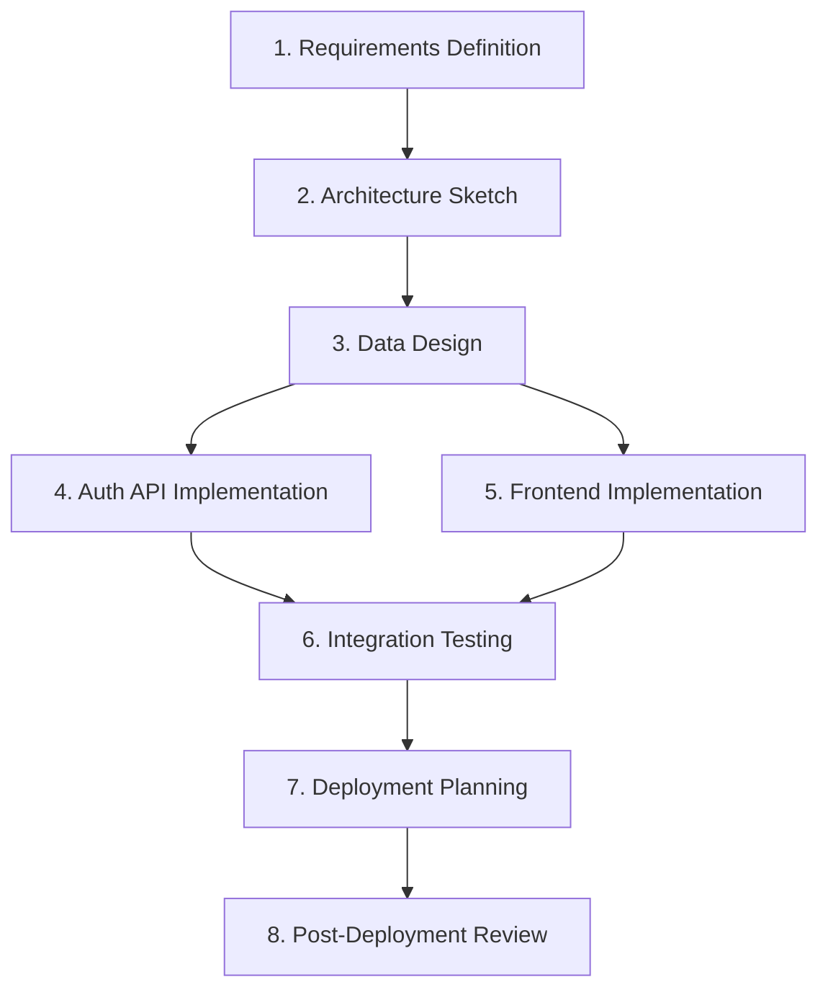

# 📋 Mission Planning Guide — 미션 계획 가이드

## 1. 개요 (Overview)

본 문서는 **Mission 목표를 SSDAM Task로 분해하고**
전체 실행 흐름을 설계하는 절차를 정의한다.

개별 Task 설계는 다음 문서를 따른다:

`04_methodology/task-design-guide.md`

본 가이드는 다음에 집중한다:

- Task 간 관계
- 의존성 구조
- Composition 설계
- Mission 레벨 정책

---

## 계획 절차 (Planning Procedure)

```
Goal 분해 → Task 식별 → Dependency 분석 → Composition 설계 → Policy 정의 → Plan 검증
```

---

## 2. Step 1 — Goal 분해

최종 Mission Objective를 **독립적으로 검증 가능한 하위 목표**로 분해한다.

### 2.1 분해 기준

| 기준 | 핵심 질문 |
|------|------------|
| Verifiability | 객관적 PASS/FAIL 판단 가능한가? |
| Independence | 독립 검증 가능한가? |
| Artifact Presence | 결과가 Artifact로 표현 가능한가? |

---

### 2.2 분해 절차

1. 최종 Objective 정의  
2. 반복 질문:  
   **“성공 전에 무엇이 검증되어야 하는가?”**  
3. 의미 없는 세분화 시 중단  
4. 각 하위 목표 검증

---

### 2.3 Example

최종 Objective:  
“사용자 인증 기능을 포함한 웹 애플리케이션 제공”

```
웹 애플리케이션 제공
├─ Requirements 검증 완료?
├─ Architecture 검증 완료?
├─ Data Model 검증 완료?
├─ Auth API 구현/검증 완료?
├─ Frontend 구현/검증 완료?
├─ Integration Tests PASS?
├─ Deployment Strategy 정의?
└─ 운영 안정성 검증?
```

---

### 2.4 안티패턴

❌ "백엔드 완료"  
❌ "좋은 UX 만들기"  
✅ "인증 API 구현 및 테스트 PASS"

---

## 3. Step 2 — Task 식별

하위 목표를 **SSDAM Task로 변환**한다.

### 3.1 변환 규칙

| 조건 | 규칙 |
|------|------|
| Single Purpose | 복수 목적이면 분리 |
| Produces Artifact | 아니면 Task 부적합 |
| Checkpoint 종료 가능 | 정의 불가 시 재설계 |
| I/O Contract 명시 가능 | 불명확 시 Scope 조정 |

---

### 3.2 Task List Example

| # | Task | Purpose | Key Artifact |
|---|------|---------|--------------|
| 1 | Requirements Definition | 요구사항 구조화 | requirements.md |
| 2 | Architecture Sketch | 시스템 구조 정의 | architecture.md |
| 3 | Data Design | 엔티티 모델링 | schema.mmd |
| 4 | Auth API Implementation | 인증 엔드포인트 구현 | auth-api |
| 5 | Frontend Implementation | UI 구성 | frontend |
| 6 | Integration Testing | 시스템 검증 | test-report.json |
| 7 | Deployment Planning | 배포 전략 정의 | deploy-plan.md |
| 8 | Post-Deployment Review | 운영 안정성 검증 | post-deploy-report.md |

---

### 3.3 검증 질문

- 모든 하위 목표가 Task로 매핑되었는가?
- 누락된 검증 단위는 없는가?
- 복수 목적 Task 존재 여부?

---

## 4. Step 3 — Dependency 분석

**Artifact 기반 의존성 구조 분석**

### 4.1 Dependency Matrix Example

| Task | Prerequisite | Required Artifact |
|------|--------------|-------------------|
| Requirements Definition | — | — |
| Architecture Sketch | Requirements Definition | requirements.md |
| Data Design | Architecture Sketch | architecture.md |
| Auth API Implementation | Data Design | schema.mmd |
| Frontend Implementation | Data Design | schema.mmd |
| Integration Testing | Auth API + Frontend | auth-api, frontend |
| Deployment Planning | Integration Testing | test-report.json |
| Post-Deployment Review | Deployment Planning | deploy-plan.md |

---

### 4.2 분석 규칙

- 의존성은 Artifact 기반이어야 함
- Artifact 독립 시 Parallel 후보
- 순환 의존 금지

---

### 4.3 안티패턴

❌ 암묵적 의존성  
❌ 활동 기반 순서  
✅ Artifact 기반 규칙  

---

## 5. Step 4 — Composition 설계

참조:

`03_architecture/task-composition.md`

---

### 5.1 Pattern 적용

| 상황 | Pattern |
|------|----------|
| 선형 의존성 | Sequential |
| 독립 분기 | Parallel |
| Checkpoint 분기 | Conditional |
| 품질 반복 루프 | Iterative |

---

### 5.2 Flow Example



---

## 6. Step 5 — Mission-Level Policy 정의

Mission 전반 정책 정의

### 6.1 Recovery Policy

- Max Recovery Attempts
- Escalation Threshold
- Rollback Scope

---

### 6.2 Quality Policy

- Coverage Threshold
- Security Threshold
- Review Requirements

---

### 6.3 Agent Policy

- Allowed Roles
- Human Checkpoint Tasks
- Confidence Threshold
- Uncertainty Escalation

---

### 6.4 Traceability Policy

- Retention Rules
- Evidence Storage
- Audit Readiness

---

## 7. Step 6 — Plan 검증

### 7.1 Checklist

**Goal 분해**

- [ ] Objective 명확성
- [ ] 하위 목표 검증 가능

**Task 식별**

- [ ] 단일 목적 Task
- [ ] Artifact 정의

**Dependencies**

- [ ] Artifact 기반
- [ ] 순환 의존 없음

**Composition**

- [ ] Pattern 명시
- [ ] Parallel 독립성 검증

**Policies**

- [ ] Recovery
- [ ] Quality
- [ ] Agent
- [ ] Traceability

---

## 8. Planning Template

```md
# Mission: [Name]

## Final Objective
[한 문장]

## Task List
| # | Task | Purpose | Artifact |

## Dependency Matrix
| Task | Prerequisite | Artifact |

## Flow
[Mermaid Diagram]

## Composition Summary
| Segment | Pattern |

## Mission Policies
### Recovery
### Quality
### Agent
### Traceability
```

---

## ✅ 핵심 요약 (Key Summary)

Mission Planning은:

> **Task 목록 작성이 아니라  
> 검증 가능한 Task들을 Contract · Dependency · Policy로 연결하는 설계 활동이다.**

잘 설계된 Mission Plan은:

- 결정적 실행 구조 보장
- 실패/복구 경로 사전 정의
- Traceability 안정성 확보
