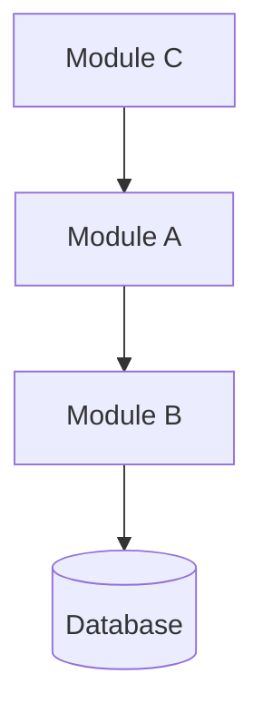
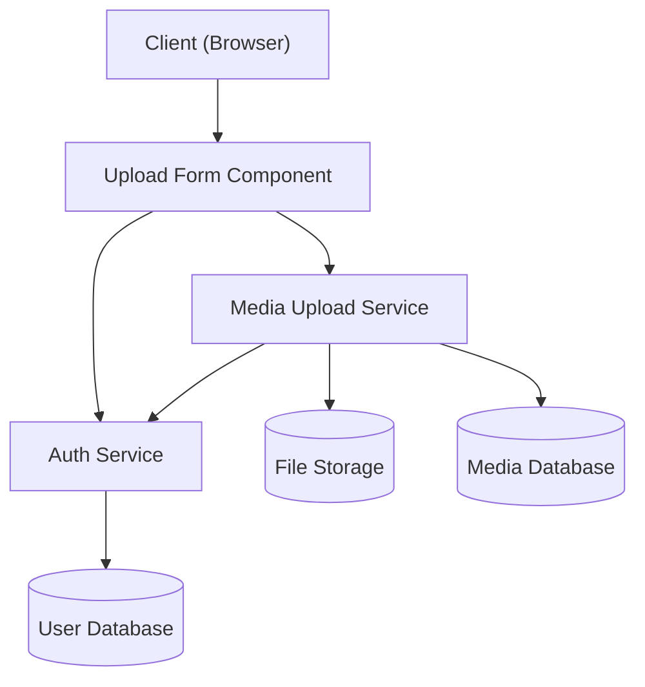

# architecture-design Skill

## File Paths Reference

This skill reads from and writes to the SSDAM pipeline workspace:

```
task-spec.TSK-NNN.yaml (user provides path)
  ↓
[architecture-design]  ← YOU ARE HERE
  ↓
.ssdam/{id}/output/design/architecture-design.TSK-NNN.md
  ↓
[data-modeling | backend-design | frontend-design]  (any/all, based on task scope)
  ↓
[backend-implementation | frontend-implementation] (dependent on designs above)
```

**Skill files (read-only):**
- `/mnt/ssdam/templetes/architecture-design/SKILL.md` (this file)
- `/mnt/ssdam/templetes/architecture-design/references/input.template.yaml` (input schema reference)
- `/mnt/ssdam/templetes/architecture-design/references/output.template.yaml` (output schema reference)
- `/mnt/ssdam/templetes/architecture-design/references/rules.md` (design rules and anti-patterns)

**Runtime files (created per execution):**
- Input: `task-spec.TSK-NNN.yaml` (user provides path, e.g., `.ssdam/media-marketplace-20260221-001/output/task-spec.TSK-001.yaml`)
- Output: `.ssdam/{id}/output/design/architecture-design.TSK-NNN.md` (written by this skill)

---

## Overview

| | |
|---|---|
| **Trigger** | `/architecture-design <task-spec-path>` |
| **Input** | `task-spec.TSK-NNN.yaml` (YAML file path) |
| **Work** | Load task spec → analyse scope → write architecture design document |
| **Output** | `.ssdam/{id}/output/design/architecture-design.TSK-NNN.md` (Markdown file) |
| **Required** | **YES** — must run before any other execution skill |

---

## Input Specification

### Trigger Command
```
/architecture-design <task-spec-path>
```

**Example:**
```
/architecture-design .ssdam/media-marketplace-20260221-001/output/task-spec.TSK-001.yaml
```

### Fields Read from task-spec

The agent reads these fields from the input `task-spec.TSK-NNN.yaml`:

**From `metadata`:**
- `mission_id` — copied to output document header (e.g., "MIS-20260221-001")
- `task_id` — used to derive output filename (TSK-NNN)
- `task_name` — used as document title
- `task_owner` — metadata only
- `requirement_ids` — for traceability

**From `purpose`:**
- `statement` — one-sentence goal of this task
- `scope_included` — list of what IS in scope; everything here must appear in the design
- `scope_excluded` — list of what is NOT in scope; guard rails to prevent scope creep

**From `output_contract`:**
- List of deliverables (artifacts) the architecture must account for
  - Each entry has: `output_artifact`, `artifact_id`, `contract_specification`

**From `execution_plan`:**
- `tech_stack`:
  - `backend` — e.g., "FastAPI, Pydantic, SqlModel"
  - `frontend` — e.g., "Svelte, TailwindCSS"
  - `database` — e.g., "PostgreSQL"
  - `project_root` — absolute path to project repository
- `steps[]` where `exec_type == "architecture-design"`:
  - `exec_id` — step identifier (e.g., "EXEC-01")
  - `description` — what to design in this step
  - `acceptance_criteria` — what file/content must exist when done

---

## Pre-Execution Verification

Before starting the main execution procedure, perform these checks:

**1. Validate task-spec file**
- [ ] File exists at the provided path
- [ ] File is valid YAML (no syntax errors)
- [ ] File contains all required sections: `metadata`, `purpose`, `output_contract`, `execution_plan`

**2. Verify architecture-design step exists**
- [ ] `execution_plan.steps` array is non-empty
- [ ] At least one step has `exec_type: "architecture-design"`
- [ ] If no such step exists, **STOP** and inform the user: "This task-spec does not include an architecture-design execution step. Verify the task-spec is correct."

**3. Verify output_contract is non-empty**
- [ ] `output_contract` array contains at least one entry
- [ ] If empty, **STOP** and inform the user: "Cannot design architecture without knowing what deliverables to produce. Add entries to output_contract."

**4. Derive workspace directory**
- From the task-spec path (e.g., `.ssdam/media-marketplace-20260221-001/output/task-spec.TSK-001.yaml`):
  - Workspace dir = `.ssdam/{id}/` (parent of parent)
  - Design output dir = `.ssdam/{id}/output/design/`

**5. Create design output directory**
- [ ] Create `.ssdam/{id}/output/design/` if it does not exist
- [ ] Verify directory is writable
- [ ] If creation or write permission fails, **STOP** and report the error

---

## Execution Procedure

Execute the following 6 steps in order. After each step, the agent accumulates information to assemble the final output document.

### Step 1 — Load task-spec

**Action:** Parse the `task-spec.TSK-NNN.yaml` file.

**Extract and store:**
- `metadata.mission_id` → `output.metadata.mission_id`
- `metadata.task_id` → `output.metadata.task_id` (derive NNN)
- `metadata.task_name` → `output.metadata.task_name`
- `purpose.statement` → scope overview
- `purpose.scope_included` → list of all scope items (must appear in design)
- `purpose.scope_excluded` → list of guard rails
- `output_contract` → list of deliverables
- `execution_plan.tech_stack` → store backend, frontend, database, project_root
- `execution_plan.steps[exec_type=="architecture-design"]` → find and store this step's description and acceptance_criteria

**Error handling:**
- If parsing fails, report YAML error and stop
- If required sections are missing, report which section and stop

---

### Step 2 — Analyse Task Scope

**Action:** Determine which modules/components this task involves by examining the output_contract and scope_included.

**For each entry in `output_contract`:**
- Is it a **backend artifact**? Examples: API endpoint, service, data migration, authentication handler, business logic service
  - If yes: mark "backend design needed"
- Is it a **frontend artifact**? Examples: component, page, UI form, dashboard, navigation
  - If yes: mark "frontend design needed"
- Is it a **database artifact**? Examples: new entity, schema migration, data model, relationship
  - If yes: mark "data modeling needed"

**For each item in `scope_included`:**
- Does it mention a module name that should appear in the design?
- Does it mention a user-facing interface (frontend)?
- Does it mention data storage (database)?
- Does it mention external integration?

**Output of this step:**
- A set of "identified modules" — modules that will appear in the design
- A boolean flag for each follow-on skill: `needs_data_modeling`, `needs_backend_design`, `needs_frontend_design`

**Example analysis:**
```
Task: "Build media upload API and upload form UI"
scope_included:
  - "Upload API endpoint (POST /api/v1/media/upload)"
  - "Form component for file selection"
  - "MediaFile entity in database"

Analysis result:
  modules: [AuthService, MediaUploadService, MediaFileEntity, UploadFormComponent]
  needs_backend_design: true (MediaUploadService, AuthService)
  needs_frontend_design: true (UploadFormComponent)
  needs_data_modeling: true (MediaFileEntity)
```

---

### Step 3 — Design Module Boundaries

**Action:** For each module identified in Step 2, define its scope, responsibility, and interfaces.

**For each module, define:**

| Field | Description |
|-------|-------------|
| **module** | Module name (e.g., "Auth Service", "Media Upload Service") |
| **responsibility** | Single sentence describing the module's single responsibility (e.g., "Handles user authentication and token management") |
| **interfaces** | List of public APIs, events, or data this module exposes (e.g., `["POST /auth/login", "GET /auth/verify", "event: user.authenticated"]`) |
| **depends_on** | List of other modules or external systems this module reads from (e.g., `["User Database", "JWT Token Provider"]`) |

**Single Responsibility Principle:**
- Each module must have ONE reason to change
- If a module has multiple responsibilities, split it into multiple modules
- Example anti-pattern: "AuthService" that also sends emails — split into "AuthService" and "NotificationService"

**Interfaces must be concrete:**
- Backend: REST endpoints (path + method), gRPC services, or queue topics
- Frontend: component props, events, or page routes
- Database: primary key, foreign keys, or indexes

**Dependencies are directional:**
- Draw from "depends on" to understand the call graph
- Circular dependencies are an anti-pattern — flatten or introduce a mediator

**Output of this step:**
- List of 3–8 modules (for typical task scope)
- Each with responsibility, interfaces, and dependencies

**Example:**
```
Module: Auth Service
  Responsibility: Validate user credentials and issue JWT tokens
  Interfaces:
    - POST /auth/login (credentials) → token
    - GET /auth/verify (token) → user_id, roles
    - POST /auth/logout (token) → success
  Depends on:
    - User Database
    - JWT token provider

Module: Media Upload Service
  Responsibility: Accept file uploads, validate, store, and return media metadata
  Interfaces:
    - POST /media/upload (multipart file) → media_id, url
    - GET /media/{media_id} → metadata
  Depends on:
    - Auth Service (for authorization)
    - File Storage (S3 or local)
    - Media Database
```

---

### Step 4 — Draw Component Diagram

**Action:** Create a Mermaid `graph TD` diagram showing all modules and their relationships.

**Diagram rules:**
- Use `graph TD` for top-down layout (readable left-to-right and top-to-bottom)
- Node labels must be quoted: `AuthService["Auth Service"]`
- Arrows show **data flow direction**: `AuthService --> MediaUploadService` means "MediaUploadService calls AuthService"
- External systems (databases, file storage) shown as cylinders: `DB[(PostgreSQL)]`
- Maximum 12 nodes per diagram — if more, split into subgraphs or layered diagrams
- No crossing lines — arrange modules to minimize visual clutter

**Syntax:**


**Example for media marketplace:**


**Verification:**
- [ ] All modules from Step 3 appear in the diagram
- [ ] External systems are shown
- [ ] Data flow arrows are directional and sensible
- [ ] No isolated nodes (all connected to at least one other node)
- [ ] Mermaid syntax is valid (agent must test if possible)

---

### Step 5 — Define Domain Entities and API Contract Overview

**Action:** List domain entities and API endpoints.

#### 5a — Domain Entities

**For each domain entity referenced in the task:**

| Field | Description |
|-------|-------------|
| **entity** | Entity name (e.g., "User", "MediaFile", "UploadTask") |
| **table** | Expected database table name (e.g., "users", "media_files") |
| **key_fields** | List of important fields (e.g., `["id (UUID)", "email (unique)", "created_at (timestamp)"]`) |
| **relationships** | Relationships to other entities (e.g., `["belongs_to User", "has_many Comment"]`) |

**Scope:**
- Only list entities that are **directly created or modified by THIS task**
- Do not list entities only "read" from existing tables (unless they are being modified)
- Include all fields that appear in the output_contract's `contract_specification`

**Example:**
```
Entity: MediaFile
  Table: media_files
  Key fields:
    - id (UUID, primary key)
    - upload_id (FK to uploads)
    - filename (string, 255 chars)
    - mime_type (string)
    - size_bytes (integer)
    - storage_url (string, S3 path)
    - created_at (timestamp)
    - updated_at (timestamp)
  Relationships:
    - belongs_to User (via uploads.user_id)
    - has_many Comment
```

#### 5b — API Contract Overview

**For each API endpoint hinted in the output_contract:**

| Field | Description |
|-------|-------------|
| **endpoint** | Full endpoint path and method (e.g., `POST /api/v1/media/upload`) |
| **method** | HTTP method (GET, POST, PUT, DELETE, PATCH) |
| **purpose** | One sentence describing what the endpoint does |
| **request_summary** | Key request fields (headers, body, query params) |
| **response_summary** | Key response fields (status codes, body structure) |

**Scope:**
- Only list endpoints that are **created in THIS task**
- Do not list endpoints from existing, unmodified services
- Extract endpoint paths from `output_contract.contract_specification`

**Example:**
```
Endpoint: POST /api/v1/media/upload
  Method: POST
  Purpose: Accept a file upload, validate, store, and return media metadata
  Request summary:
    - Content-Type: multipart/form-data
    - Body: file (binary), metadata (JSON)
    - Headers: Authorization (Bearer token)
  Response summary:
    - Status: 201 Created (success), 400 Bad Request (validation error), 401 Unauthorized
    - Body: { media_id: UUID, url: string, size_bytes: integer }

Endpoint: GET /api/v1/media/{media_id}
  Method: GET
  Purpose: Retrieve metadata for a previously uploaded media file
  Request summary:
    - Path param: media_id (UUID)
    - Headers: Authorization (Bearer token)
  Response summary:
    - Status: 200 OK, 404 Not Found, 401 Unauthorized
    - Body: { id, filename, mime_type, size_bytes, url, created_at }
```

---

### Step 6 — Write and Verify Output

**Action:** Assemble all sections from Steps 1–5 into the output markdown file.

#### 6a — Assemble the Markdown File

Create file: `.ssdam/{id}/output/design/architecture-design.TSK-NNN.md`

**File structure:**

```markdown
# Architecture Design — [TASK-NAME]

**Task:** TSK-NNN
**Mission:** MIS-YYYYMMDD-NNN
**Created:** YYYY-MM-DDTHH:mm:ssZ
**Tech Stack:** [backend] / [frontend] / [database]

---

## Overview

**Goal:** [purpose statement from task-spec, one sentence]

**Scope Summary:**
[Condensed list of scope_included items — what IS being designed]

[Condensed list of scope_excluded items — what is NOT being designed]

**Tech Stack:**
- Backend: [framework, ORM, auth library]
- Frontend: [framework, CSS, UI library]
- Database: [engine, version]
- Project Root: [path]

---

## Module Boundaries

[For each module from Step 3:]

### [Module Name]

**Responsibility:** [single sentence]

**Interfaces (APIs, events, data exposed):**
- [interface 1]
- [interface 2]
- ...

**Dependencies (reads from):**
- [dependency 1]
- [dependency 2]
- ...

---

## Component Diagram

[Mermaid diagram from Step 4, in markdown code block]

```mermaid
graph TD
  [nodes and edges from Step 4]
```

---

## API Contract Overview

[For each endpoint from Step 5b:]

### [HTTP METHOD] [ENDPOINT]

**Purpose:** [one sentence]

**Request:**
- [fields summary]

**Response:**
- [status codes and fields summary]

---

## Domain Entities

[For each entity from Step 5a:]

### [Entity Name]

**Database Table:** `[table_name]`

**Key Fields:**
- [field name] ([type], [constraints])
- ...

**Relationships:**
- [relationship description]
- ...

---

## Design Decisions

[For each significant architectural choice:]

### [Decision Title]

**Decision:** [concise statement]

**Rationale:** [why this choice was made]

**Alternatives Considered:**
- [alternative 1 and why it was rejected]
- [alternative 2 and why it was rejected]

---

## Next Steps

Based on the analysis of this task, the following execution skills should be run next:

[For each applicable skill, provide:]
- **Skill:** [skill name]
- **Why:** [condition that triggered this recommendation]
- **Command:** [/skill-name <task-spec-path>]

Example:
- **Skill:** data-modeling
  - **Why:** Task includes database entities (MediaFile, Comment, Upload)
  - **Command:** `/data-modeling .ssdam/media-marketplace-20260221-001/output/task-spec.TSK-001.yaml`

---

## Self-Validation

- [x] All items in scope_included are addressed in at least one section
- [x] All output_contract deliverables are traceable to a module or endpoint
- [x] Mermaid diagram syntax is valid
- [x] No modules violate single responsibility principle
- [x] Module dependencies form a valid DAG (no circular dependencies)
- [x] All external systems (DB, file storage) are shown in diagram

```

#### 6b — Verify Output Against Requirements

Before writing, verify:

1. **Scope Coverage Rule**
   - [ ] Every item in `scope_included` appears in at least one section (module description, endpoint, entity, or diagram)
   - [ ] No items from `scope_excluded` appear in any section

2. **Output Contract Traceability**
   - [ ] Every `output_contract` entry is traceable to at least one module in module_boundaries OR one endpoint in api_contract_overview
   - [ ] No orphaned deliverables

3. **Mermaid Diagram Validity**
   - [ ] Uses `graph TD` syntax
   - [ ] All node labels are quoted: `NodeName["Label"]`
   - [ ] All arrows are directional: `A --> B`
   - [ ] No more than 12 nodes (split into subgraphs if needed)
   - [ ] No syntax errors (validate with Mermaid parser if available)

4. **Domain Entity Scope**
   - [ ] Only entities directly created or modified in THIS task are listed
   - [ ] All fields from output_contract.contract_specification appear in at least one entity

5. **API Contract Completeness**
   - [ ] Every endpoint created in this task is listed
   - [ ] Request and response summaries are concrete (not vague)

6. **Module Validation**
   - [ ] Each module has a single responsibility (SRP)
   - [ ] No module appears in its own dependency list (no self-loops)
   - [ ] No circular dependencies between modules

7. **Next Skills Recommendation**
   - [ ] `data-modeling` is recommended if domain_entities is non-empty
   - [ ] `backend-design` is recommended if api_contract_overview is non-empty
   - [ ] `frontend-design` is recommended if scope_included mentions UI/page/component
   - [ ] At least one skill is recommended (architecture without follow-on design is incomplete)

**Error Handling:**
- If any verification fails, stop and fix before writing
- Log which verification(s) failed and what was fixed

---

## Post-Execution Summary

After successfully writing the output file, print a confirmation message:

```
✓ architecture-design.TSK-NNN.md written to:
  .ssdam/{id}/output/design/architecture-design.TSK-NNN.md

Next execution skills to run (based on task scope analysis):

  [If needs_data_modeling:]
  ► /data-modeling .ssdam/{id}/output/task-spec.TSK-NNN.yaml
    (Domain entities detected: [list entity names])

  [If needs_backend_design:]
  ► /backend-design .ssdam/{id}/output/task-spec.TSK-NNN.yaml
    (Backend services detected: [list module names])

  [If needs_frontend_design:]
  ► /frontend-design .ssdam/{id}/output/task-spec.TSK-NNN.yaml
    (Frontend components detected: [list component names])

Run these skills in any order. They will all read this architecture-design output.
```

---

## Error Handling Reference

| Error | Condition | Action |
|-------|-----------|--------|
| **Task-spec file not found** | File path does not exist | Stop execution. Report the full path attempted. Suggest the user verify the path. |
| **Invalid YAML syntax** | YAML parser error | Stop execution. Report the line number and parse error. Suggest the user validate the YAML. |
| **No architecture-design step** | No step in execution_plan.steps has `exec_type: "architecture-design"` | Stop execution. Inform user: "This task-spec does not include an architecture-design execution step." |
| **Empty output_contract** | output_contract array is empty or missing | Stop execution. Inform user: "Cannot design architecture without deliverables. Add entries to output_contract." |
| **Design output directory not writable** | `.ssdam/{id}/output/design/` exists but is not writable, or creation fails | Stop execution. Report permission error. Suggest user check directory permissions. |
| **Mermaid diagram syntax invalid** | Graph TD syntax error detected | Fix the diagram. Re-validate before writing. Report what was fixed. |
| **Module SRP violation detected** | A module has multiple responsibilities | Reject the design. Instruct agent to split module or refine scope. Report which module. |
| **Circular dependency in modules** | Module A depends on B, B depends on A | Reject the design. Instruct agent to flatten dependencies or introduce mediator. Report the cycle. |
| **Scope coverage incomplete** | Item in scope_included not addressed in any section | Reject the document. Report which scope item is missing. Instruct agent to add to a section. |
| **Output contract not traceable** | Deliverable in output_contract has no corresponding module or endpoint | Reject the document. Report which deliverable. Instruct agent to add module or endpoint. |

---

## Implementation Notes for the Agent

1. **Workspace Derivation:**
   - Input path: `.ssdam/media-marketplace-20260221-001/output/task-spec.TSK-001.yaml`
   - Workspace: `.ssdam/media-marketplace-20260221-001/`
   - Design output dir: `.ssdam/media-marketplace-20260221-001/output/design/`
   - Output filename: `architecture-design.TSK-001.md`

2. **Task ID Extraction:**
   - From filename `task-spec.TSK-NNN.yaml`, extract `NNN`
   - Use `NNN` in output filename: `architecture-design.TSK-NNN.md`

3. **Validation is Strict:**
   - Pre-execution checks MUST pass before proceeding
   - Output verification MUST pass before writing
   - If any check fails, stop and report — do not attempt to work around

4. **Scope is Sacred:**
   - Everything in `scope_included` must be in the design
   - Nothing in `scope_excluded` may appear in the design
   - This boundary is non-negotiable

5. **Traceability is Mandatory:**
   - Every deliverable in output_contract must be traceable to a module or endpoint
   - This traceability is the proof that the design is complete

6. **Next Skills are Recommendations:**
   - The agent recommends which skills to run next based on the design
   - The user decides which to actually run
   - The agent should not assume all skills will be run

