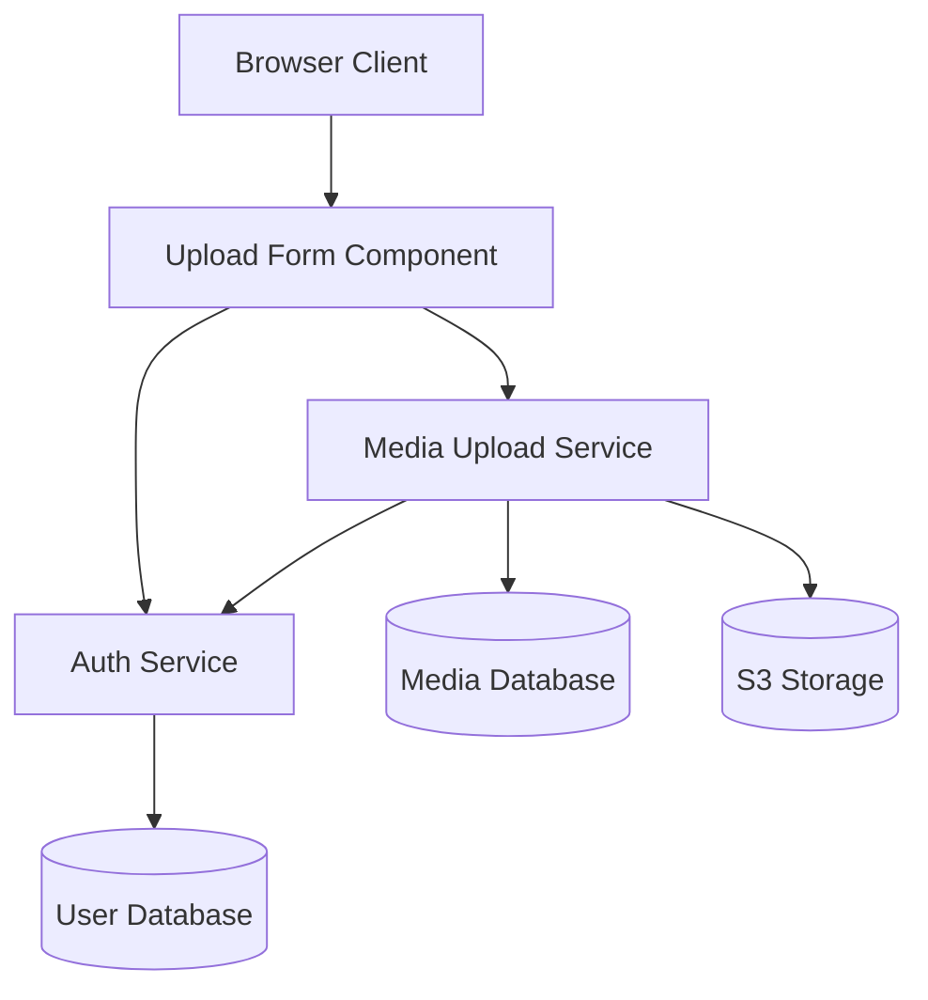

# Architecture Design — Rules and Constraints

This document defines the rules that the `architecture-design` skill must follow when producing design documents. These rules ensure consistency, completeness, and correctness across all SSDAM pipeline executions.

---

## 1. Output File Naming Rule

**Rule:** The output file MUST be named `architecture-design.TSK-NNN.md`

**Derivation:**
- Extract `NNN` from the input `task-spec.TSK-NNN.yaml` filename
- Use the same `NNN` in the output: `architecture-design.TSK-NNN.md`

**Examples:**
- Input: `task-spec.TSK-001.yaml` → Output: `architecture-design.TSK-001.md`
- Input: `task-spec.TSK-042.yaml` → Output: `architecture-design.TSK-042.md`

**Rationale:** Consistent naming allows downstream skills to locate the architecture design input by simply replacing "task-spec" with "architecture-design" in the filename.

---

## 2. Scope Coverage Rule

**Rule:** Every item in `task_spec.purpose.scope_included` MUST be addressed in at least one section of the output document.

**What "addressed" means:**
- Mentioned explicitly by name or concept
- Assigned to a module in `module_boundaries`
- Described in an endpoint in `api_contract_overview`
- Listed as a domain entity in `domain_entities`
- Shown in the component diagram with appropriate connections
- Referenced in a design decision's rationale

**Verification:**
Before writing the output document, the agent must:
1. Create a checklist of all `scope_included` items
2. For each item, identify which section(s) address it
3. If any item has no section, add a section to address it
4. In `self_validation.scope_items_addressed`, list which items are covered by which sections

**Example:**
```
Scope included:
  - "Upload API endpoint (POST /api/v1/media/upload)"  ← covered in api_contract_overview
  - "Media database entities (MediaFile, Tag)"         ← covered in domain_entities
  - "File storage integration (S3)"                    ← covered in module_boundaries (FileStorageService)
  - "Upload form component with progress bar"         ← covered in module_boundaries (UploadFormComponent)

Self-validation result: All 4 items addressed ✓
```

**Rationale:** Scope coverage ensures the architecture is complete and no requirements are accidentally omitted.

---

## 3. Output Contract Traceability Rule

**Rule:** Every entry in `task_spec.output_contract` MUST be traceable to at least one module in `module_boundaries` OR one endpoint in `api_contract_overview`.

**What "traceable" means:**
- A deliverable (output_artifact) is assigned to exactly one module or endpoint
- The contract_specification fields are reflected in the module/endpoint definition
- There is a documented chain from deliverable → module/endpoint → implementation

**Traceability Chain Example:**
```
Output Contract Entry:
  - output_artifact: "REST API"
    artifact_id: "MEDIA-UPLOAD-API"
    contract_specification: "POST /api/v1/media/upload"

Traceability:
  MEDIA-UPLOAD-API → MediaUploadService module → POST /api/v1/media/upload endpoint

Verification:
  ✓ Module "MediaUploadService" exists in module_boundaries
  ✓ Endpoint "POST /api/v1/media/upload" exists in api_contract_overview
  ✓ Endpoint is in the "Interfaces" list of MediaUploadService
```

**Verification:**
Before writing the output document, the agent must:
1. Create a checklist of all `output_contract` entries
2. For each entry, identify its owner module or endpoint
3. If any entry has no owner, add a module or endpoint
4. Document the traceability in `self_validation.traceable_deliverables`

**Rationale:** Traceability ensures all promised deliverables are architecturally assigned and will be implemented.

---

## 4. Mermaid Diagram Rules

**Rule:** The component diagram MUST use Mermaid `graph TD` syntax and follow these constraints:

### 4a — Syntax and Structure
- **Syntax:** Use `graph TD` for top-down layout (not `flowchart`, not `graph LR`)
- **Node definition:** All node labels MUST be quoted
  - ✓ Correct: `AuthService["Auth Service"]`
  - ✗ Incorrect: `AuthService[Auth Service]` (missing quotes)
- **Arrow direction:** Arrows show data flow direction
  - `ServiceA --> ServiceB` means "ServiceA calls/sends to ServiceB"
  - Never use `<--` or `---` (bidirectional) — always directional
- **Node naming:** Use identifiers (no spaces) for node IDs
  - ✓ Correct: `AuthService["Auth Service"]` (identifier: `AuthService`, label: "Auth Service")
  - ✗ Incorrect: `Auth Service["Auth Service"]` (invalid identifier with spaces)

### 4b — Complexity Constraints
- **Maximum 12 nodes per diagram:** If more nodes are needed, split into multiple diagrams
  - Example: Main diagram (6 nodes) + API layer diagram (4 nodes) + Data layer diagram (3 nodes)
- **Subgraphs for grouping:** If multiple diagrams are used, use Mermaid subgraphs
  ```
  graph TD
    subgraph API["API Layer"]
      AuthService["Auth Service"]
      MediaService["Media Service"]
    end

    subgraph Data["Data Layer"]
      UserDB[(User DB)]
      MediaDB[(Media DB)]
    end

    AuthService --> UserDB
    MediaService --> MediaDB
  ```

### 4c — Visual Clarity Rules
- **External systems as cylinders:** Databases, file storage, external APIs
  - ✓ Correct: `UserDB[(PostgreSQL)]` or `FileStorage[(S3 Bucket)]`
  - ✗ Incorrect: `UserDB["PostgreSQL"]` (should be cylinder for clarity)
- **No crossing lines:** Arrange nodes to minimize visual clutter
  - Use subgraphs or layers to separate concerns
  - Order nodes logically (left-to-right, top-to-bottom)
- **All nodes must be connected:** No isolated nodes
  - Every node must have at least one incoming or outgoing arrow
  - Exception: Entry point nodes (Client, User) may have outgoing only
- **Label clarity:** Node labels should be human-readable and match module names exactly
  - Use proper casing and spaces in labels (not identifiers)
  - Example: `AuthService["Auth Service"]` not `AuthService["auth_service"]`

### 4d — Syntax Validation
Before writing the output document, the agent MUST validate Mermaid syntax:
1. Test the diagram in a Mermaid parser (if available)
2. Verify all nodes are properly quoted and defined
3. Verify all arrows are valid (no typos like `---->` or missing `>`)
4. Verify no circular arrows (e.g., `A --> B --> A`) unless intentionally showing circular dependency
5. Count nodes: if ≥12, split into multiple diagrams

**Example of correct diagram:**


**Rationale:** Clear, valid diagrams communicate architecture to stakeholders and prevent implementation errors.

---

## 5. Domain Entity Rules

**Rule:** List only domain entities that are DIRECTLY CREATED OR MODIFIED by THIS TASK.

### 5a — Scope of Listed Entities
- **Include:** Entities with new fields, new relationships, or schema migrations in this task
- **Exclude:** Entities only "read" from existing tables without modification
- **Exclude:** Entities from other tasks or pre-existing (unless this task modifies them)

**Example:**
```
Task scope: "Build media upload API and store metadata in new MediaFile table"

Entities to include:
  ✓ MediaFile (new table created in this task)
  ✓ Upload (new table tracking upload sessions)
  ✗ User (exists before this task; not modified by this task)
  ✗ Comment (referenced but not created/modified in this task)
```

### 5b — Required Entity Fields
For each entity, include:
- **Entity name:** Exact name as it appears in code/database
- **Table name:** Database table name (lowercase, snake_case)
- **Key fields:** All fields that appear in `output_contract.contract_specification`
- **Field format:** `name (type, constraints)`
  - Examples: `id (UUID, primary key)`, `email (string, unique, max 255)`, `created_at (timestamp, default now())`
- **Relationships:** Natural language descriptions
  - Examples: `"belongs_to User"`, `"has_many Comment"`, `"many_to_many_via TagMediaFile"`

### 5c — Completeness Verification
Before writing, verify:
1. Every field in `output_contract.contract_specification` appears in at least one entity
2. Every entity has at least one key field (not just metadata)
3. Every relationship is reciprocal (if MediaFile has_many Comment, Comment should belong_to MediaFile)

**Example:**
```
Output Contract Entry:
  contract_specification: "MediaFile entity with id, filename, mime_type, size_bytes, storage_url"

Entity Definition:
  Entity: MediaFile
  Table: media_files
  Key fields:
    - id (UUID, primary key)
    - filename (string, 255)
    - mime_type (string, 50)
    - size_bytes (integer)
    - storage_url (string)
    - created_at (timestamp, default now())
    - updated_at (timestamp, default now())
  Relationships:
    - belongs_to User (via user_id FK)
    - has_many Comment
```

**Rationale:** Listing only in-scope entities prevents database schema bloat and keeps the design focused.

---

## 6. Next Skills Recommendation Rule

**Rule:** The `next_skills` section MUST recommend at least one follow-on skill based on the analysis. Never recommend zero skills.

### 6a — Recommendation Logic

| Condition | Recommended Skill | Why |
|-----------|-------------------|-----|
| `domain_entities` list is non-empty | `data-modeling` | Database design needed for identified entities |
| `api_contract_overview` is non-empty | `backend-design` | Backend implementation needed for identified endpoints |
| `scope_included` mentions UI/page/component | `frontend-design` | Frontend implementation needed |

### 6b — Recommendation Format
For each recommended skill, provide:
- **Skill name:** Exact name of the skill
- **Condition:** Why this skill is recommended
- **Command:** Full trigger command the user should run (with actual task-spec path)

**Example:**
```markdown
## Next Steps

Based on the analysis, run:

- **Skill:** data-modeling
  - **Why:** Task creates 3 database entities (MediaFile, Upload, Comment)
  - **Command:** `/data-modeling .ssdam/media-marketplace-20260221-001/output/task-spec.TSK-001.yaml`

- **Skill:** backend-design
  - **Why:** Task defines 5 REST API endpoints (POST, GET, DELETE for media)
  - **Command:** `/backend-design .ssdam/media-marketplace-20260221-001/output/task-spec.TSK-001.yaml`

- **Skill:** frontend-design
  - **Why:** Task includes upload form component with progress tracking
  - **Command:** `/frontend-design .ssdam/media-marketplace-20260221-001/output/task-spec.TSK-001.yaml`
```

**Rationale:** Recommendations guide the user on which execution skills to run next, based on the architecture design.

---

## 7. Anti-patterns (Prohibited)

The following patterns are **PROHIBITED** in architecture designs. If detected, the agent must reject the design and fix the issue before writing.

| Anti-pattern | Why It's Prohibited | How to Fix |
|---|---|---|
| **Module with >1 responsibility** | Violates Single Responsibility Principle; makes dependency tracking impossible; complicates testing and maintenance | Split into multiple focused modules, each with one reason to change |
| **API endpoint with no owner module** | Unassigned endpoints cause implementation gaps; unclear who implements it | Assign endpoint to exactly one module in the module_boundaries section |
| **Domain entity not traceable to output_contract** | Entity scope creep; database bloat; unclear why entity exists | Only include entities specified in output_contract or explicitly required by scope_included |
| **Scope_excluded items appearing in design** | Boundary violation; scope creep; overpromising | Remove any section mentioning excluded items; add to next_skills if deferred |
| **Mermaid diagram with >12 nodes (no subgraphs)** | Unreadable; overwhelms stakeholders; indicates over-scoped design | Split into multiple layered diagrams (API, service, data layers) using subgraphs |
| **Circular module dependencies** | Impossible to implement without introducing mediators; creates tight coupling | Flatten dependencies by introducing a mediator module or refactoring responsibilities |
| **Empty next_skills list** | Design is a dead end; no follow-on work identified; incomplete design | Always identify at least one follow-on skill; if none, design scope is too small |
| **Component diagram not matching module_boundaries** | Inconsistency; modules documented but not visualized; confusion | Ensure every module in module_boundaries appears in the diagram |
| **Scope_included items without representation** | Incomplete design; some requirements not addressed; missed components | Add missing items to module_boundaries, api_contract_overview, or domain_entities |
| **Output_contract deliverables not traceable** | Unclear how deliverables will be implemented; unassigned work | Create a traceability chain from each deliverable to a module or endpoint |

**Detection and Resolution:**
Before writing the output document, the agent runs validation checks:
1. Module SRP check: Does each module have exactly one responsibility?
2. Endpoint ownership check: Is each endpoint in the "Interfaces" of exactly one module?
3. Entity traceability check: Is each entity explained by output_contract or scope_included?
4. Scope exclusion check: Does the design mention any excluded items?
5. Diagram complexity check: Does the diagram have ≤12 nodes (or is properly subgraphed)?
6. Dependency cycle check: Are there any circular dependencies in the module dependency graph?
7. Next skills check: Is the next_skills list non-empty?
8. Diagram-boundaries consistency check: Does every module appear in the diagram?
9. Scope coverage check: Is every scope_included item addressed?
10. Output contract traceability check: Is every deliverable assigned to a module or endpoint?

If any check fails, **STOP** the writing process, report the anti-pattern, and instruct the agent to fix it.

---

## 8. Self-Validation Checklist

After designing but before writing, the agent must verify:

- [ ] **Scope Coverage**: Every item in `scope_included` is addressed in at least one section
  - How to check: Create a checklist of scope items; map each to design sections
  - Document in: `self_validation.scope_items_addressed[]`

- [ ] **Output Contract Traceability**: Every `output_contract` entry is traceable to a module or endpoint
  - How to check: Create a checklist of deliverables; map each to a module or endpoint
  - Document in: `self_validation.traceable_deliverables[]`

- [ ] **Mermaid Diagram Validity**: Syntax is correct; ≤12 nodes; all modules represented
  - How to check: Validate syntax; count nodes; verify module inclusion
  - Document in: `self_validation.checks.mermaid_diagram_valid`, `checks.diagram_node_count`

- [ ] **Module SRP**: Each module has a single responsibility; no module appears in its own dependencies
  - How to check: Read each module's responsibility; verify one-sentence focus; check depends_on list
  - Document in: `self_validation.checks.module_singleresponsibility`, `checks.circular_dependencies[]`

- [ ] **API Contract Completeness**: All endpoints are created in THIS task; request/response are concrete
  - How to check: Verify each endpoint against output_contract; check fields are specific, not vague
  - Document in: `self_validation.checks.api_contract_complete`, `checks.endpoint_count`

- [ ] **Domain Entity Scope**: Only entities created/modified in THIS task; all output_contract fields included
  - How to check: Verify each entity is mentioned in output_contract or scope_included; check all fields present
  - Document in: `self_validation.checks.domain_entity_scope_correct`, `checks.entity_count`

- [ ] **Next Skills Recommended**: At least one follow-on skill; triggers are valid commands
  - How to check: Verify next_skills list is non-empty; verify trigger commands use correct path
  - Document in: `self_validation.checks.next_skills_recommended`, `checks.recommended_skill_count`

---

## 9. Example: Complete Validation

**Scenario:** Designing architecture for media upload API task (TSK-001)

**Input:**
```yaml
scope_included:
  - "Upload API endpoint (POST /api/v1/media/upload)"
  - "Media metadata database entities"
  - "S3 file storage integration"
  - "Upload form component with progress bar"

output_contract:
  - artifact: "REST API", spec: "POST /api/v1/media/upload, GET /api/v1/media/{id}"
  - artifact: "Component", spec: "UploadForm component with progress tracking"
  - artifact: "Database Schema", spec: "MediaFile, Upload tables"
```

**Design Output:**

Modules:
- ✓ AuthService (responsibility: token validation)
- ✓ MediaUploadService (responsibility: receive, validate, store uploads)
- ✓ UploadFormComponent (responsibility: file input, progress display)

Endpoints:
- ✓ POST /api/v1/media/upload (owned by MediaUploadService)
- ✓ GET /api/v1/media/{id} (owned by MediaUploadService)

Entities:
- ✓ MediaFile (in output_contract)
- ✓ Upload (in scope_included)

Diagram:
- ✓ Shows all 3 modules + DB + File Storage (5 nodes, valid)

Next Skills:
- ✓ data-modeling (2 entities identified)
- ✓ backend-design (2 endpoints)
- ✓ frontend-design (1 component)

**Validation Result:** ✓ All checks pass. Proceed to write output.

---

## 10. Version Control

| Version | Date | Changes |
|---------|------|---------|
| v1.0.0 | 2026-02-21 | Initial release. Define core rules for architecture-design skill. |

