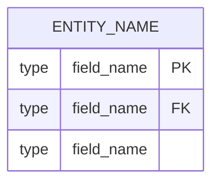
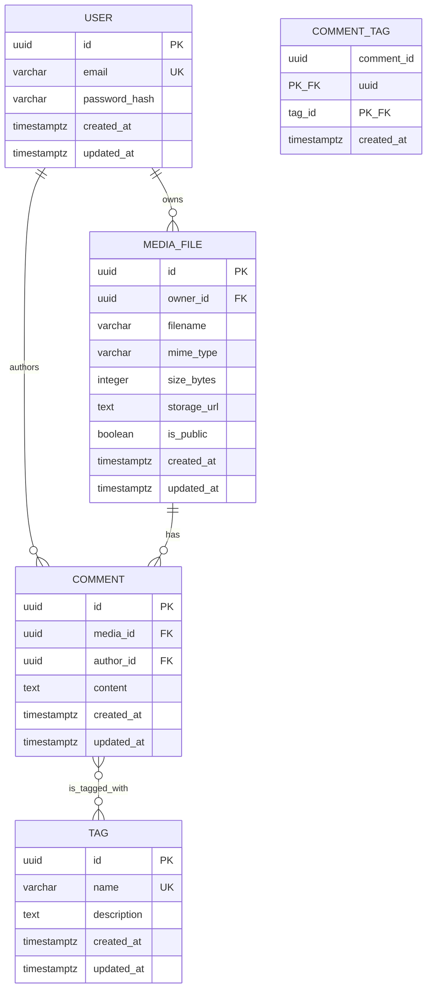

# data-modeling Skill

## File Paths Reference

This skill reads from and writes to the SSDAM pipeline workspace:

```
task-spec.TSK-NNN.yaml (user provides path)
  + architecture-design.TSK-NNN.md (from .ssdam/{id}/output/design/)
  ↓
[data-modeling]  ← YOU ARE HERE
  ↓
.ssdam/{id}/output/design/data-modeling.TSK-NNN.md
  ↓
[schema-design]  (optional — run if DDL is needed)
  ↓
[backend-design]  (proceeds to backend without schema-design if no DB changes)
```

**Skill files (read-only):**
- `/mnt/ssdam/templetes/data-modeling/SKILL.md` (this file)
- `/mnt/ssdam/templetes/data-modeling/references/input.template.yaml` (input schema reference)
- `/mnt/ssdam/templetes/data-modeling/references/output.template.yaml` (output schema reference)
- `/mnt/ssdam/templetes/data-modeling/references/rules.md` (naming and design rules)

**Runtime files (created per execution):**
- Input 1: `task-spec.TSK-NNN.yaml` (user provides path)
- Input 2: `.ssdam/{id}/output/design/architecture-design.TSK-NNN.md` (prerequisite)
- Output: `.ssdam/{id}/output/design/data-modeling.TSK-NNN.md` (written by this skill)

---

## Overview

| | |
|---|---|
| **Trigger** | `/data-modeling <task-spec-path>` |
| **Prerequisites** | `architecture-design.TSK-NNN.md` must exist at `.ssdam/{id}/output/design/` |
| **Input** | task-spec.TSK-NNN.yaml + architecture-design output |
| **Work** | Parse architecture → extract domain entities → define fields, types, relationships → draw ERD |
| **Output** | `.ssdam/{id}/output/design/data-modeling.TSK-NNN.md` (Markdown file with YAML frontmatter + Mermaid diagram) |
| **Optional** | Only run if task includes database entities; skip if no entities in scope |

---

## Input Specification

### Trigger Command

```
/data-modeling <task-spec-path>
```

**Example:**
```
/data-modeling .ssdam/media-marketplace-20260221-001/output/task-spec.TSK-001.yaml
```

### Fields Read from task-spec

From `task-spec.TSK-NNN.yaml`:

**From `metadata`:**
- `mission_id` — copied to output document header
- `task_id` — used to derive output filename (TSK-NNN)
- `task_name` — used as document title

**From `execution_plan`:**
- `tech_stack.database` — confirms database type (PostgreSQL, MySQL, etc.)
- `steps[]` where `exec_type == "data-modeling"`: accept_criteria should define what entities/fields are expected

### Fields Read from architecture-design Output

From `.ssdam/{id}/output/design/architecture-design.TSK-NNN.md`:

**From `domain_entities` section:**
- For each entity: `entity`, `table`, `key_fields`, `relationships`

This is the source of truth for which entities this task creates or modifies.

---

## Pre-Execution Verification

Before starting the main execution procedure, perform these checks:

**1. Validate task-spec file**
- [ ] File exists at the provided path
- [ ] File is valid YAML (no syntax errors)
- [ ] File contains required sections: `metadata`, `execution_plan`

**2. Derive workspace directory**
- From the task-spec path (e.g., `.ssdam/media-marketplace-20260221-001/output/task-spec.TSK-001.yaml`):
  - Workspace dir = `.ssdam/{id}/` (extract from parent of parent)
  - Design output dir = `.ssdam/{id}/output/design/`

**3. Verify architecture-design output exists**
- [ ] Extract task_id from task-spec (TSK-NNN)
- [ ] Check `.ssdam/{id}/output/design/architecture-design.TSK-NNN.md` exists
- If NOT found: **STOP** and inform user: "architecture-design.TSK-NNN.md not found. Run /architecture-design first."

**4. Parse architecture-design output**
- [ ] Read the markdown file
- [ ] Locate `## Domain Entities` section
- [ ] Confirm at least one entity exists

**5. Verify domain entities exist**
- If the `domain_entities` section is empty or missing: **STOP** and inform user: "This task has no database entities — data-modeling not needed. Proceed to backend-design."

**6. Verify database is configured**
- [ ] `execution_plan.tech_stack.database` is set (not null)
- If not: **STOP** and inform user: "Database not configured in task-spec. Cannot design data model."

---

## Execution Procedure

Execute the following 6 steps in order. After each step, accumulate information to assemble the final output document.

### Step 1 — Load Inputs

**Action:** Parse both input files.

**Extract from task-spec.TSK-NNN.yaml and store:**
- `metadata.mission_id` → `output.mission_id`
- `metadata.task_id` → `output.task_id` (derive NNN)
- `metadata.task_name` → `output.task_name`
- `execution_plan.tech_stack.database` → `output.database`

**Extract from architecture-design.TSK-NNN.md and store:**
- Copy the entire `domain_entities` section (entity name, table, key_fields, relationships)
- This is the list of entities this task touches

**Error handling:**
- If YAML parsing fails, report error and stop
- If architecture-design is malformed, report which section is invalid

---

### Step 2 — Extract Domain Entities from Architecture Design

**Action:** Read the `domain_entities` section from architecture-design output and map each entity.

**For each entity in the architecture domain_entities list:**
- Confirm it has: `entity` name (PascalCase), `table` name (snake_case plural)
- If `entity` is empty: **SKIP** this entry and warn
- If `table` is empty: generate table name from entity (e.g., `User` → `users`, `MediaFile` → `media_files`)
- Extract the `key_fields` list (these will be expanded into full field definitions in Step 3)
- Extract the `relationships` list (these will be refined into proper FK definitions in Step 4)

**Scope decision:**
- Mark each entity as "created" (this task is responsible for DDL) or "referenced" (this task reads from it but doesn't modify structure)
- From architecture-design: entities with "created_by: TSK-NNN" in relationships are "created"
- Others are "referenced" (you will include these in the ERD but their FK fields come later)

**Example:**
- Architecture lists: `MediaFile` (created in TSK-001), `User` (referenced, created in TSK-000)
- Result: Include both in ERD; only MediaFile gets full field definition

---

### Step 3 — Define Entity Fields

**Action:** For each entity, define its fields with PostgreSQL types and constraints.

**For each entity, define:**

| Field | Rules | Example |
|-------|-------|---------|
| `entity_name` | PascalCase, noun | `MediaFile`, `UploadTask`, `Comment` |
| `table_name` | snake_case plural | `media_files`, `upload_tasks`, `comments` |
| `primary_key` | Always `id` of type UUID with default gen_random_uuid() | `id UUID PRIMARY KEY DEFAULT gen_random_uuid()` |

**Standard fields every entity must have:**

1. **Primary Key (always first)**
   ```
   - name: id
     type: UUID
     nullable: false
     default: gen_random_uuid()
     unique: true
   ```

2. **Timestamps (always last two)**
   ```
   - name: created_at
     type: TIMESTAMPTZ
     nullable: false
     default: NOW()

   - name: updated_at
     type: TIMESTAMPTZ
     nullable: false
     default: NOW()
   ```

3. **Domain-specific fields (middle)**
   - Extract from `key_fields` in architecture design
   - For each field:
     - `name`: snake_case (e.g., `filename`, `user_id`, `mime_type`)
     - `type`: PostgreSQL native type:
       - String with known max length: `VARCHAR(n)` (e.g., `VARCHAR(255)`)
       - Unbounded string: `TEXT`
       - Unique identifier: `UUID`
       - Timestamp: `TIMESTAMPTZ` (never `DATETIME`)
       - Whole number: `INTEGER` or `BIGINT`
       - Boolean flag: `BOOLEAN`
       - JSON data: `JSONB`
     - `nullable`: `true` or `false` (required fields are `false`)
     - `default`: value or NULL (typically NULL for most fields; only add if domain rule requires default)
     - `unique`: `true` if this field must be unique (e.g., `email`)

**Example: MediaFile entity**
```yaml
entity_name: MediaFile
table_name: media_files
fields:
  - name: id
    type: UUID
    nullable: false
    default: gen_random_uuid()
    unique: true
  - name: owner_id
    type: UUID
    nullable: false
    default: null
    unique: false
  - name: filename
    type: VARCHAR(255)
    nullable: false
    default: null
    unique: false
  - name: mime_type
    type: VARCHAR(100)
    nullable: false
    default: null
    unique: false
  - name: size_bytes
    type: INTEGER
    nullable: false
    default: null
    unique: false
  - name: storage_url
    type: TEXT
    nullable: false
    default: null
    unique: false
  - name: is_public
    type: BOOLEAN
    nullable: false
    default: false
    unique: false
  - name: created_at
    type: TIMESTAMPTZ
    nullable: false
    default: NOW()
  - name: updated_at
    type: TIMESTAMPTZ
    nullable: false
    default: NOW()

primary_key: id

indexes:
  - name: idx_media_files_owner_id
    columns: [owner_id]
    unique: false
  - name: idx_media_files_filename
    columns: [filename]
    unique: false
```

---

### Step 4 — Define Relationships and Foreign Keys

**Action:** For each relationship mentioned in architecture design, define it formally with FK constraints.

**For each relationship from architecture-design:**

| Field | Description | Example |
|-------|-------------|---------|
| `from_entity` | Entity that holds the foreign key | `MediaFile` |
| `to_entity` | Referenced entity | `User` |
| `relationship_type` | `one_to_one` \| `one_to_many` \| `many_to_many` | `one_to_many` |
| `fk_field` | Name of FK column on `from_entity` | `owner_id` |
| `junction_table` | (Many-to-many only) Table name for the relationship | `media_file_tags` |

**Rules for relationships:**

- **one_to_many**: `from_entity` has a nullable or non-nullable FK to `to_entity`
  - Example: `MediaFile.owner_id → User.id` (one user owns many files)
  - FK field: `owner_id` on `media_files` table
  - Optional (nullable): if media can exist without owner; Mandatory (NOT NULL): if every media must have an owner

- **one_to_one**: Similar to one_to_many but cardinality is exactly one
  - Example: `UserProfile.user_id → User.id` (one user has one profile)
  - FK field: `user_id` on `user_profiles` (with UNIQUE constraint)

- **many_to_many**: Define a junction table
  - Example: `Comment` has_many `Tag`, `Tag` has_many `Comment`
  - Create junction table: `comment_tags` with:
    - Compound primary key: `(comment_id, tag_id)`
    - FKs: `comment_id UUID NOT NULL REFERENCES comments(id)`, `tag_id UUID NOT NULL REFERENCES tags(id)`
    - Timestamp: `created_at TIMESTAMPTZ DEFAULT NOW()`
    - No `updated_at` for junction tables (they are immutable)

**Example relationships:**
```yaml
relationships:
  - from_entity: MediaFile
    to_entity: User
    relationship_type: one_to_many
    fk_field: owner_id
    junction_table: null

  - from_entity: Comment
    to_entity: MediaFile
    relationship_type: one_to_many
    fk_field: media_id
    junction_table: null

  - from_entity: Comment
    to_entity: Tag
    relationship_type: many_to_many
    fk_field: null
    junction_table: comment_tags
```

---

### Step 5 — Draw Mermaid ERD

**Action:** Create a Mermaid `erDiagram` block showing all entities, fields, and relationships.

**Mermaid erDiagram rules:**
- Entity names: ALL_CAPS (convention for Mermaid ER diagrams)
- Show all entities from Step 2 (both created and referenced)
- For each entity: show PK, FK fields, and key business fields
- Relationship notation:
  - `||--o{` = one-to-many (left side one, right side many)
  - `||--||` = one-to-one
  - `}o--o{` = many-to-many
- Label each relationship with a short name (e.g., "owns", "has", "is_tagged_with")

**Syntax:**


**Full example:**


**Verification:**
- [ ] All entities from Step 2 appear in the diagram
- [ ] All PKs are marked
- [ ] All FKs are marked
- [ ] Relationship lines match the cardinality (one-to-many, one-to-one, many-to-many)
- [ ] Mermaid syntax is valid (no missing braces, quotes, or semicolons)

---

### Step 6 — Define Indexes

**Action:** For each entity, specify which columns need indexes (beyond the PK).

**Index rules:**

1. **Primary Key Index (always)**
   - `idx_{table_name}_id` (implicit, created by PRIMARY KEY constraint)

2. **Foreign Key Indexes (always)**
   - Every FK column gets an index for fast lookups
   - Example: `idx_media_files_owner_id` on `media_files(owner_id)`

3. **Search/Query Indexes (domain-dependent)**
   - If a field is searched by API query params, it needs an index
   - Examples:
     - `user.email` → index (often used in login, lookup)
     - `media_file.filename` → index (often searched/filtered)
     - `media_file.created_at` → index (often sorted by date)
     - `comment.created_at` → index (often sorted)

4. **Unique Indexes (for constraints)**
   - If a field must be unique, create unique index
   - Examples:
     - `user.email` → UNIQUE INDEX
     - `tag.name` → UNIQUE INDEX

**Format for output:**
```yaml
indexes:
  - name: idx_table_column
    columns: [column_name]
    unique: false

  - name: idx_table_column_unique
    columns: [column_name]
    unique: true
```

**Example for media_files:**
```yaml
indexes:
  - name: idx_media_files_owner_id
    columns: [owner_id]
    unique: false
  - name: idx_media_files_filename
    columns: [filename]
    unique: false
  - name: idx_media_files_created_at
    columns: [created_at]
    unique: false
```

---

### Step 7 — Verify and Write Output

**Action:** Assemble all sections and verify against requirements.

**Verification checklist:**

- [ ] All entities from Step 2 are in the output
- [ ] Each entity has: id (PK), created_at, updated_at
- [ ] Each entity's fields have concrete PostgreSQL types (not vague types)
- [ ] Each FK field is marked in fields list AND in relationships list
- [ ] Every FK has a corresponding index
- [ ] Many-to-many relationships have junction tables defined
- [ ] Mermaid erDiagram is syntactically valid
- [ ] Scope: only entities created/modified in THIS task (not read-only references)
- [ ] All relationships from architecture-design are present

**Error handling:**
- If entity has no PK: Add default `id UUID PRIMARY KEY DEFAULT gen_random_uuid()` and warn
- If FK has no index: Add required index and warn
- If relationship is self-referential (e.g., Comment.parent_comment_id → Comment.id): Allow, mark as "hierarchical relationship"

**Write output file:**

Create: `.ssdam/{id}/output/design/data-modeling.TSK-NNN.md`

Structure:
```markdown
---
document_type: data-modeling
task_id: TSK-NNN
mission_id: MIS-...
created_at: YYYY-MM-DDTHH:mm:ssZ
source_document: architecture-design.TSK-NNN.md
---

# Data Modeling — [TASK-NAME]

[YAML block with entities, relationships, indexes, erd_diagram]

## Entity Definitions

[For each entity:]
### [Entity Name]
[Details of fields, constraints, indexes]

## Relationships

[Visual description of relationships]

## ERD Diagram

[Mermaid erDiagram in markdown code block]
```

---

## Post-Execution Summary

After successfully writing the output file, print a confirmation message:

```
✓ data-modeling.TSK-NNN.md written to:
  .ssdam/{id}/output/design/data-modeling.TSK-NNN.md

Entities defined: [count]
Relationships: [count]

Next: run /schema-design <task-spec-path>  (if DDL is needed)
   or run /backend-design <task-spec-path>  (to proceed without schema generation)
```

---

## Error Handling Reference

| Error | Condition | Action |
|-------|-----------|--------|
| **architecture-design.TSK-NNN.md not found** | File does not exist at expected path | Stop. Inform user: "Run /architecture-design first." |
| **domain_entities section empty** | No entities defined in architecture output | Stop. Inform user: "This task has no database entities — data-modeling not needed." |
| **Entity without primary key** | Entity defined but PK is missing | Add default UUID PK. Warn user of added default. |
| **FK without corresponding entity** | Relationship references entity not in scope | Error. Inform user: "FK references entity outside task scope. Check architecture-design." |
| **FK without index** | Foreign key column not indexed | Add required index. Warn user of added index. |
| **Mermaid syntax error** | ER diagram fails to parse | Fix syntax. Re-validate. Report what was fixed. |
| **Circular relationships** | Entity A references B, B references A | Allow (common pattern). Document as bidirectional. |
| **Namespace collision** | Two entities with same table_name | Error. Inform user: "Duplicate table name. Check entity definitions." |

---

## Implementation Notes for the Agent

1. **Workspace Derivation:**
   - Input path: `.ssdam/media-marketplace-20260221-001/output/task-spec.TSK-001.yaml`
   - Workspace: `.ssdam/media-marketplace-20260221-001/`
   - Design output dir: `.ssdam/media-marketplace-20260221-001/output/design/`
   - Output filename: `data-modeling.TSK-001.md`

2. **Task ID Extraction:**
   - From task-spec filename `task-spec.TSK-NNN.yaml`, extract `NNN`
   - Use in output filename: `data-modeling.TSK-NNN.md`

3. **Entity Scope Decision:**
   - Include entities that are **created or modified** by this task
   - Include references to other entities (for FK relationships)
   - Do NOT expand into fields of read-only reference entities (schema-design will handle those if they exist)

4. **Type Safety:**
   - Always use PostgreSQL-native types (UUID, TIMESTAMPTZ, BIGINT)
   - Never use old aliases (CHAR(36) for UUID, DATETIME for timestamp)
   - Validate type names against PostgreSQL documentation

5. **Relationship Cardinality:**
   - Be precise: one-to-one vs. one-to-many
   - Many-to-many ALWAYS requires junction table (never composite FK)

6. **Next Skill Decision:**
   - Recommend `/schema-design` if DDL generation is needed (usually yes)
   - User may skip if they already have DDL or are doing data-only work

